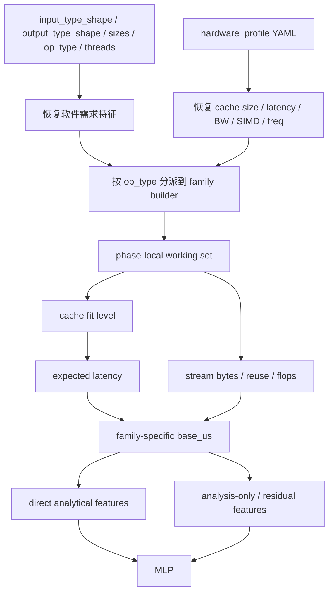
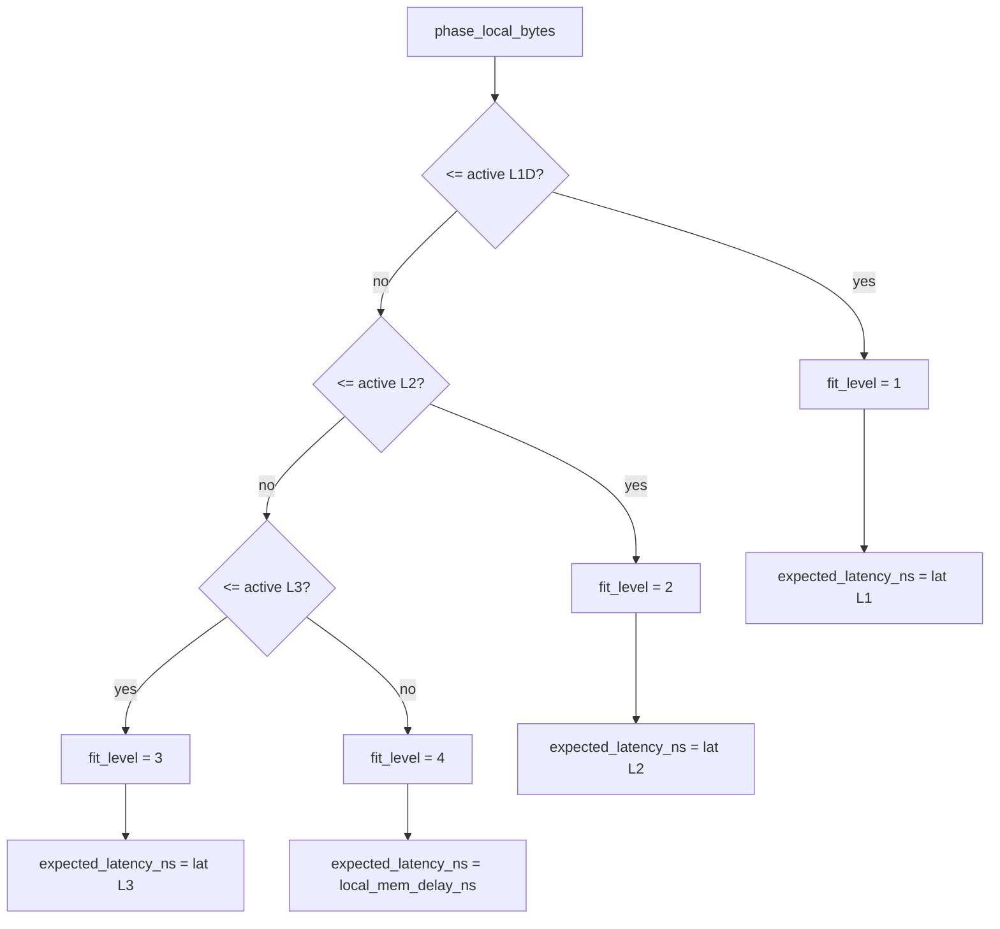
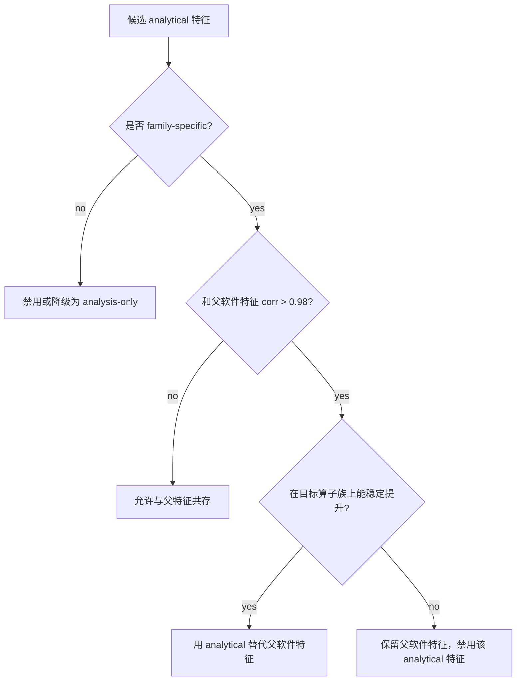
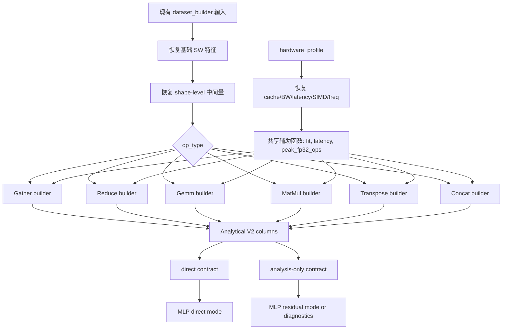

# Analytical Model V2 for `single_op_stage1_mlp`

这份文档给 `single_op_stage1_mlp` 里的 `Analytical Model V2` 做完整设计说明。目标不是直接把一个更复杂的解析模型硬塞进 MLP，而是把 ORT CPU kernel 的真实执行语义拆出来，重构一批更有物理含义、也更有泛化语义的软硬件结合特征。

这份文档回答 6 个问题：

1. 为什么 V1 的全局 `ana_*` 不够好
2. ORT CPU 里 `Gather`、`ReduceSum`、`Gemm`、`MatMul`、`Transpose`、`Concat` 具体是怎么做的
3. 为什么这些 kernel 应该用不同的 analytical model
4. 每个新特征表达什么含义
5. 每个新特征依赖哪些参数，这些参数现在是否已经在数据集中
6. 整体实现和验证流程应该怎么组织

## 1. 设计目标

### 1.1 我们要解决什么问题

当前 `single_op_stage1_mlp` 已经有一批有效的软硬件交互特征，例如：

- `hw_ratio_working_set_to_l1d_active_bytes`
- `hw_ratio_working_set_to_l2_active_bytes`
- `hw_ratio_working_set_to_l3_active_bytes`
- `comp_feat_pressure_ws_to_l2_ratio`
- `comp_feat_pressure_ws_to_l3_ratio`
- `ana_cache_fit_level`
- `ana_expected_latency_ns`

这些特征能抓住一阶的 cache capacity / latency 影响，但它们仍然有两个明显限制：

- 它们更接近“全局尺寸代理”，而不是“按算子访存机制拆开的局部工作集模型”
- 当前一批 analysis-only 的 `ana_*` 里，很多列在单硬件训练下容易退化成“软件特征换了个单位”

最典型的例子是：

- `ana_mem_bw_time_us = feat_io_bytes_sum / (bandwidth_gb_s_total * 1e3)`

在当前单 NUMA Kunpeng920 profile 下，`bandwidth_gb_s_total` 是常数 `100 GB/s`，所以：

```text
ana_mem_bw_time_us = feat_io_bytes_sum * 1e-5
```

这意味着它和 `feat_io_bytes_sum` 在当前硬件上是严格线性等价的。这样的 analytical 特征如果继续和纯软件特征一起喂给 MLP，通常只会增加冗余，而不是提供新信息。

### 1.2 V2 的核心原则

V2 固定采用下面三条原则：

- `Analytical ⊂ HWxSW`
- 所有 analytical 特征都必须基于“软件需求 + 硬件供给 + kernel 执行机制”的组合，而不是简单乘除
- analytical model 只建模对延迟最关键的一阶机制，剩余误差交给 MLP 学习

这里最重要的一句话是：

> V2 建模的对象不是“整算子总共有多少字节”，而是“这个算子的哪个执行阶段，在多大的局部工作集下，以什么样的访问模式，落在哪一级 cache / memory tier 上执行”。

## 2. V1 为什么不够

当前全局 analytical 列如下：

- `ana_cache_fit_level`
- `ana_expected_latency_ns`
- `ana_compute_ops`
- `ana_roofline_base_us`
- `ana_base_us`
- `ana_mem_bw_time_us`
- `ana_latency_proxy_us`
- `ana_ridge_gap`

这些列里，真正比较稳的是：

- `ana_cache_fit_level`
- `ana_expected_latency_ns`

原因很直接：它们至少把“工作集是否落进 L1/L2/L3”以及“超出后要付哪一级 latency”表达出来了。

而另外几列之所以还没进入主合同，不是因为 analytical 的方向错了，而是因为“建模粒度还不够细”：

- `ana_compute_ops` 是全局统一公式，没有区分 `Gather`、`Transpose` 这种 copy-dominated kernel 和 `Gemm` 这种 compute-dominated kernel
- `ana_roofline_base_us` 假定同一套 roofline 语义适用于所有算子族，这对 `Concat`、`Transpose`、`Gather` 并不成立
- `ana_latency_proxy_us` 把所有访存都近似成 `bytes / cacheline * expected_latency`，没有区分“流式 copy”和“随机 gather miss”
- `ana_ridge_gap` 对 `Gemm/MatMul` 有意义，对 `Concat/Transpose` 基本没有意义

所以 V2 的核心改动不是“再加更多全局 `ana_*`”，而是：

- 把 analytical feature family 改成 `family-specific`
- 把每个算子拆成若干执行阶段
- 把阶段工作集和 cache tier 绑定起来

## 3. ORT CPU kernel 分析结论

本节使用 ORT 官方 CPU kernel 源码作为第一手依据。这里不把源码逐行搬进来，而是提炼出建模真正需要的 kernel 语义。

源码入口：

- [`onnxruntime/core/providers/cpu/tensor/gather.cc`](https://github.com/microsoft/onnxruntime/blob/main/onnxruntime/core/providers/cpu/tensor/gather.cc)
- [`onnxruntime/core/providers/cpu/reduction/reduction_ops.cc`](https://github.com/microsoft/onnxruntime/blob/main/onnxruntime/core/providers/cpu/reduction/reduction_ops.cc)
- [`onnxruntime/core/providers/cpu/math/gemm.cc`](https://github.com/microsoft/onnxruntime/blob/main/onnxruntime/core/providers/cpu/math/gemm.cc)
- [`onnxruntime/core/providers/cpu/math/matmul.cc`](https://github.com/microsoft/onnxruntime/blob/main/onnxruntime/core/providers/cpu/math/matmul.cc)
- [`onnxruntime/core/providers/cpu/tensor/transpose.cc`](https://github.com/microsoft/onnxruntime/blob/main/onnxruntime/core/providers/cpu/tensor/transpose.cc)
- [`onnxruntime/core/providers/cpu/tensor/concat.cc`](https://github.com/microsoft/onnxruntime/blob/main/onnxruntime/core/providers/cpu/tensor/concat.cc)

### 3.1 总结表

| 算子 | ORT CPU 内核语义 | 对 cache 最敏感的对象 | 为什么不能和其他算子共用一套 analytical 公式 |
| --- | --- | --- | --- |
| `Gather` | index 驱动的 block copy，源地址不规则，目标写入连续 | source row reuse、L3/DRAM latency | 它不是“全张量顺序读”，而是“按索引离散取块” |
| `ReduceSum` | 先做 shape collapse，再按 `KR/RK/KRK/RKR/...` 走不同 fast path | accumulator 驻留、reduce axis 是否连续 | 连续归约和非连续归约的 miss 行为完全不同 |
| `Gemm` | bias broadcast + MLAS Gemm + activation，可 `PackB` | weight reuse、tile 驻留、SIMD 吞吐 | 核心是 blocked compute，不是简单 bytes 模型 |
| `MatMul` | `MatMulComputeHelper` + batched MLAS Gemm，可 `PackB` | batch reuse、rhs broadcast、weight 驻留 | 与 `Gemm` 相近，但 batch 结构不同 |
| `Transpose` | 先判定 reshape-like / single-axis / generic，再走 block-copy 或 eltwise-strided | suffix block size、stride locality | 不同 regime 的 cache 行为差别极大 |
| `Concat` | 对每个输入做 `DispatchStridedCopy`，沿 concat axis 推进输出偏移 | copy chunk size、streaming bandwidth | 更接近分块 copy，不是随机访存 |

### 3.2 为什么“先读权重和 bias，再读输入”不能做通用前提

这个说法不适合作为 analytical model 的通用规则。

对 `Gemm/MatMul`：

- ORT CPU float 路径最终落到 MLAS
- `B` 可能被预打包
- 实际访存次序由 MLAS 的 blocking、packing、线程分块和预取决定

也就是说：

- `bias` 常常只是一个很小的广播阶段
- `B` 是否能被 cache / packed buffer 重用，比“是不是先读”更重要
- 真正该建模的是“哪些 operand 在哪个 tile 窗口内复用”

因此，V2 不会把“读取顺序”当作主建模对象，而是建模：

- phase-local working set
- operand reuse
- cache fit level
- latency-sensitive 还是 bandwidth-sensitive

## 4. V2 的共享建模框架

### 4.1 统一符号

| 符号 | 含义 | 当前是否已在 `dataset_full.csv` |
| --- | --- | --- |
| `T` | `active_cores = min(num_threads, hw_core_total_cores)` | `num_threads` 已有；`hw_core_total_cores` 来自 hardware profile |
| `L1/L2/L3` | 活跃 cache 容量 | 由 profile 已有字段可重建 |
| `lat(L1/L2/L3/MEM)` | `response_latency_cycles / cpu_clock` 或 `local_mem_delay_ns` | profile 已有 |
| `BW` | `hw_memory_bandwidth_gb_s_total * 1e3` bytes/us | profile 已有 |
| `peak_fp32_ops_per_us` | SIMD + FMA + freq + active cores 推导出的峰值计算吞吐 | profile 已有，可重建 |
| `fit(bytes)` | bytes 落入 L1/L2/L3/MEM 的 tier 编码 | 当前可重建，未统一封装为函数列 |

### 4.2 共享流程



### 4.2.1 cache-tier 决策流程



### 4.3 参数可用性状态说明

本文件里每个参数都按下面三种状态标注：

- `已有`：当前 `dataset_full.csv` 已经导出
- `可重建`：现在的数据集里没有独立列，但可由现有 `input_type_shape`、`output_type_shape`、size 列和 hardware profile 算出来
- `需新增`：当前既没导出，也不能稳定从现有列直接恢复

## 5. 按算子族的 Analytical V2

## 5.1 Gather

### 5.1.1 ORT kernel 语义

根据 `gather.cc`：

- 先算 `block_size = element_bytes * SizeFromDimension(axis + 1)`
- 然后对每个 `(batch, index)` 组合，用 index 定位源地址
- 再执行 `memcpy(dst + dst_offset, src + src_offset, block_size)`
- 最后按 `M * N` 做并行分发

可用下面伪代码概括：

```python
block_size = element_bytes * suffix_product_after_axis
for batch in range(M):
    for i in range(num_indices):
        idx = indices[i]
        src_offset = batch * data_batch_bytes + idx * block_size
        dst_offset = batch * gathered_batch_bytes + i * block_size
        memcpy(dst + dst_offset, src + src_offset, block_size)
```

### 5.1.2 为什么这样建模

`Gather` 的核心不是“总共搬了多少字节”，而是：

- 每次 copy 的 block 有多大
- 被索引命中的 source rows 有多少 unique rows
- 这些 unique rows 是否能留在 L3
- source 侧是随机/半随机 miss，destination 侧通常是连续写

所以 `Gather` 不能再用全局 `ana_mem_bw_time_us` 或 `ana_latency_proxy_us` 近似。

### 5.1.3 新特征

| 新特征 | 含义 | 计算式 | 依赖参数与状态 |
| --- | --- | --- | --- |
| `ana_gather_row_bytes` | 单次 lookup 命中的一行 embedding/block 大小 | `feat_output_elements_per_lookup * 4` | `feat_output_elements_per_lookup` `已有` |
| `ana_gather_request_rows` | 本次总共发起多少次 row 请求 | `feat_lookup_count` | `已有` |
| `ana_gather_table_rows` | 参数表一共有多少行 | `parameter_size / max(row_bytes, 1)` | `parameter_size` `已有` |
| `ana_gather_unique_rows_est` | 本次大概会触碰多少 unique rows | `table_rows * (1 - exp(-request_rows / max(table_rows, 1)))` | `可重建` |
| `ana_gather_src_unique_bytes_est` | source 侧的局部唯一工作集大小 | `unique_rows_est * row_bytes` | `可重建` |
| `ana_gather_stream_bytes` | streaming copy 的总搬运量 | `2 * output_size + 8 * feat_lookup_count` | `output_size` `已有` |
| `ana_gather_src_fit_level` | source unique rows 落在哪级 cache | `fit(src_unique_bytes_est)` | `可重建` |
| `ana_gather_src_expected_latency_ns` | source miss 对应的预期 tier latency | `lat(fit(...))` | `可重建` |
| `ana_gather_copy_us` | copy 主导项 | `stream_bytes / BW` | `可重建` |
| `ana_gather_base_us` | Gather 的解析一阶基线 | `max(copy_us, request_rows * latency / T)` | `可重建` |

## 5.2 ReduceSum

### 5.2.1 ORT kernel 语义

根据 `reduction_ops.cc`：

- 先把 `input_shape + reduce_axes` 送进 `OptimizeShapeForFastReduce`
- 根据 collapsed shape 和 reduce/keep 片段结构，分类成 `KR/RK/KRK/RKR/R/K/None`
- 对部分 regime 使用 fast path，否则退回 `NoTransposeReduce1Loop`

可用下面伪代码概括：

```python
fast_kind = optimize_shape_for_fast_reduce(input_shape, reduce_axes)
if fast_kind in {KR, RK, KRK, RKR} and shape_is_large_enough:
    run_fast_reduce(fast_kind)
else:
    run_generic_reduce_loop()
```

### 5.2.2 为什么这样建模

`ReduceSum` 的关键不只是“reduce 了多少元素”，而是：

- reduce axis 是否连续
- partial sum 是不是能留在 L1/L2
- input 是按连续流读，还是 stride 很大的方式跳着读

所以 V2 里的 `ReduceSum` 需要一个 regime 特征，而不是只有全局 `feat_reduction_work_items`。

### 5.2.3 新特征

| 新特征 | 含义 | 计算式 | 依赖参数与状态 |
| --- | --- | --- | --- |
| `ana_reduce_fast_kind_id` | ORT fast-reduce regime 编码 | 按 `reduce/keep` 片段模式重建 | `input_type_shape/output_type_shape` `已有`, 但 `需新增` 独立导出 |
| `ana_reduce_reduce_extent` | 被归约部分的大小 | `feat_reduction_axes_product` | `已有` |
| `ana_reduce_keep_extent` | 输出保留部分的元素规模 | `max(output_size / 4, 1)` | `已有` |
| `ana_reduce_acc_bytes_per_thread` | 每线程 partial accumulator 大小 | `output_size / T` | `可重建` |
| `ana_reduce_acc_fit_level` | accumulator 驻留 tier | `fit(acc_bytes_per_thread)` | `可重建` |
| `ana_reduce_strided_flag` | 是否属于 stride 敏感 regime | `fast_kind in {RK, RKR, None}` | `需新增` |
| `ana_reduce_stream_bytes` | 输入和输出的 streaming 量 | `activation_size + output_size` | `已有` |
| `ana_reduce_expected_latency_ns` | 连续或非连续访问对应的预期 latency | `lat(acc_fit)` 或 `lat(src_fit)` | `可重建` |
| `ana_reduce_base_us` | Reduce 的解析一阶基线 | `stream_bytes / BW + strided_penalty_us` | `可重建` |

## 5.3 Gemm

### 5.3.1 ORT kernel 语义

根据 `gemm.cc`：

- 先做 bias broadcast
- 主体进入 `math::Gemm` / `MlasGemm`
- float path 支持 `PackB`
- 最后可能再做 activation

伪代码如下：

```python
broadcast_bias_if_needed(C, Y)
if K == 0:
    handle_empty_case()
else:
    if B_is_prepacked:
        MlasGemm(A, packed_B, Y)
    else:
        math.Gemm(A, B, Y)
apply_activation_if_needed(Y)
```

### 5.3.2 为什么这样建模

`Gemm` 的关键不在“总共读了多少字节”，而在：

- `2MNK` 的计算量
- `A/B/C` 三个 operand 的复用
- `B` 是否可以被缓存/预打包后重复使用
- 算子更接近 compute-bound 还是 memory-bound

因此，V2 对 `Gemm` 采用“算力 + 权重复用 + cache 驻留”的三件套，而不是全局 copy 模型。

### 5.3.3 新特征

| 新特征 | 含义 | 计算式 | 依赖参数与状态 |
| --- | --- | --- | --- |
| `ana_gemm_flops` | GEMM 理论浮点运算量 | `2 * M * N * K` | `M/N/K` 当前 `可重建`，需从 shape 单独导出 |
| `ana_gemm_ai` | arithmetic intensity | `flops / max(activation_size + parameter_size + output_size, 1)` | `activation_size/parameter_size/output_size` `已有` |
| `ana_gemm_weight_fit_level` | 权重矩阵是否能被 cache 重用 | `fit(parameter_size)` | `可重建` |
| `ana_gemm_output_fit_level` | 输出 tile/accumulator 的驻留层级 | `fit(output_size / T)` | `可重建` |
| `ana_gemm_compute_us` | 计算主导项 | `flops / peak_fp32_ops_per_us` | `可重建` |
| `ana_gemm_effective_weight_bytes` | 经过 reuse 摘要后的权重有效搬运量 | `parameter_size` 或 `parameter_size / min(max(M,1), T)` | `可重建` |
| `ana_gemm_stream_us` | memory 主导项 | `(activation_size + effective_weight_bytes + output_size) / BW` | `可重建` |
| `ana_gemm_base_us` | GEMM 一阶基线 | `max(compute_us, stream_us)` | `可重建` |
| `ana_gemm_ridge_gap` | GEMM 专用 roofline gap | `ai / ridge_point` | `可重建` |

## 5.4 MatMul

### 5.4.1 ORT kernel 语义

根据 `matmul.cc`：

- 用 `MatMulComputeHelper` 把输入 shape 归一化
- 按 batch offset 组织 `MlasGemmBatch/MlasSBGemmBatch`
- 同样支持 `PackB`

伪代码如下：

```python
helper = MatMulComputeHelper(a_shape, b_shape)
for i in range(num_batches):
    A_i = A[left_offset[i]]
    B_i = packed_B or B[right_offset[i]]
    Y_i = Y[out_offset[i]]
    MlasGemmBatch(A_i, B_i, Y_i)
```

### 5.4.2 为什么和 Gemm 分开

`MatMul` 和 `Gemm` 的主体很像，但多了 batch 结构、broadcast 和 batch offset 处理，所以需要额外区分：

- 右操作数是不是 batch-broadcast
- `B` 能否在 batch 间复用
- batch count 有多大

### 5.4.3 新特征

| 新特征 | 含义 | 计算式 | 依赖参数与状态 |
| --- | --- | --- | --- |
| `ana_matmul_batch_count` | batch 循环次数 | 由 leading dims 乘积重建 | `input/output shape` `已有`, 但 `需新增` 独立导出 |
| `ana_matmul_rhs_broadcast_flag` | 右操作数是否被 batch 复用 | 根据 rank 和 leading dims 判断 | `需新增` |
| `ana_matmul_flops` | MatMul 理论运算量 | `2 * M * N * K * batch_count` | `可重建` |
| `ana_matmul_base_us` | MatMul 一阶基线 | 基于 Gemm 公式再乘 batch 结构修正 | `可重建` |

## 5.5 Transpose

### 5.5.1 ORT kernel 语义

根据 `transpose.cc`：

- 若只是“非 1 维顺序不变”，则走 reshape-like copy
- 若只移动单个轴，则走 `SingleAxisTranspose`
- 否则进入 generic transpose
- generic transpose 继续按 `prefix_blocksize/suffix_blocksize` 选择 block-copy 或 eltwise-strided

伪代码如下：

```python
if is_transpose_reshape(perm, input_dims):
    copy_tensor()
elif is_moving_single_axis(perm):
    single_axis_transpose()
else:
    suffix_block = largest_identity_suffix(perm)
    if prefix_blocksize == 1:
        memcpy_whole_block()
    elif suffix_blocksize == 1:
        elementwise_strided_transpose()
    else:
        blockwise_transpose()
```

### 5.5.2 为什么这样建模

`Transpose` 最重要的不是总字节数，而是：

- 当前属于哪种 regime
- contiguous suffix block 有多大
- source 访问是 block-copy 还是 elementwise stride

这决定了它更像 `memcpy`，还是更像“高 miss 的 strided load/store”。

### 5.5.3 新特征

| 新特征 | 含义 | 计算式 | 依赖参数与状态 |
| --- | --- | --- | --- |
| `ana_transpose_regime_id` | reshape/single-axis/generic-block/generic-eltwise 编码 | 根据 perm 和 suffix block 规则判断 | `input/output shape` `已有`, 但 `需新增` |
| `ana_transpose_suffix_block_bytes` | contiguous suffix block 大小 | suffix dims product * dtype bytes | `可重建` |
| `ana_transpose_prefix_blocks` | 要遍历多少个 block | total elements / suffix block elements | `可重建` |
| `ana_transpose_src_fit_level` | suffix block 落在哪级 cache | `fit(suffix_block_bytes)` | `可重建` |
| `ana_transpose_stream_us` | streaming copy 主导项 | `2 * output_size / BW` | `可重建` |
| `ana_transpose_latency_us` | generic regime 的额外 latency 成本 | `prefix_blocks * latency` 或 `num_elements * latency / T` | `可重建` |
| `ana_transpose_base_us` | Transpose 一阶基线 | `stream_us + latency_us` | `可重建` |

## 5.6 Concat

### 5.6.1 ORT kernel 语义

根据 `concat.cc`：

- 先准备输出张量和输出 stride
- 依次遍历每个输入
- 对每个输入调用 `DispatchStridedCopy`
- 然后沿 concat axis 推进输出偏移

伪代码如下：

```python
output_offset = 0
for tensor in inputs:
    if tensor.num_elements == 0:
        continue
    dispatch_strided_copy(dst=Y, dst_offset=output_offset, src=tensor)
    output_offset += concat_axis_extent(tensor)
```

### 5.6.2 为什么这样建模

`Concat` 更像“多个 chunk 的串行/并行 copy 组合”，其主要影响因素是：

- 输入张量个数
- 每个 chunk 的大小
- chunk 是不是足够大到能变成稳定的流式拷贝

### 5.6.3 新特征

| 新特征 | 含义 | 计算式 | 依赖参数与状态 |
| --- | --- | --- | --- |
| `ana_concat_input_count` | 要拼接多少个输入 | 输入 tensor 数 | 当前 `需新增`，但可从 `input_type_shape` 重建 |
| `ana_concat_chunk_bytes_mean` | 平均每个 chunk 的 copy 大小 | `input_bytes_sum / input_count` | `input_bytes_sum` 当前 `需新增` |
| `ana_concat_chunk_fit_level` | 平均 chunk 落在哪级 cache | `fit(chunk_bytes_mean)` | `可重建` |
| `ana_concat_stream_bytes` | 总 streaming 量 | `input_bytes_sum + output_size` | `input_bytes_sum` `需新增` |
| `ana_concat_stream_us` | copy 主导项 | `stream_bytes / BW` | `可重建` |
| `ana_concat_dispatch_penalty_us` | 每个 chunk 的 dispatch/latency 开销 | `input_count * latency / 1000` | `可重建` |
| `ana_concat_base_us` | Concat 一阶基线 | `stream_us + dispatch_penalty_us` | `可重建` |

## 6. 新旧 analytical 特征映射

| 当前列 | V2 里的命运 | 原因 |
| --- | --- | --- |
| `ana_cache_fit_level` | 保留，但会被 family-specific `*_fit_level` 逐步替代 | 方向是对的，但现在太全局 |
| `ana_expected_latency_ns` | 保留，但会被 family-specific `*_expected_latency_ns` 逐步替代 | 方向是对的，但现在没区分 phase |
| `ana_compute_ops` | 退役为全局列 | 应拆成 `ana_gemm_flops`、`ana_matmul_flops`、`ana_reduce_*` |
| `ana_mem_bw_time_us` | 退役为 direct 特征 | 在单硬件下和 `feat_io_bytes_sum` 严格线性等价 |
| `ana_latency_proxy_us` | 退役 | 应由 `gather/reduce/transpose` 各自的 latency term 替代 |
| `ana_roofline_base_us` | 退役为全局列 | roofline 只适合 `Gemm/MatMul` 主体 |
| `ana_base_us` | 退役为全局列 | 应改成 family-specific `*_base_us` |
| `ana_ridge_gap` | 改成 `ana_gemm_ridge_gap` / `ana_matmul_ridge_gap` | 对 copy-like ops 没语义 |

## 7. 为什么不直接用 Analytical 特征替代纯软件特征

结论固定为：**不能全局替代，只能局部替代。**

原因有三点：

- 纯软件特征表达的是 workload demand，本身仍然是必要输入
- analytical 特征表达的是“被硬件条件化后的 demand”
- 在单硬件数据下，如果 analytical 特征只是纯软件特征乘了一个常数，它就不应该和父软件特征共存

正确做法是：

- 保留最小必要的软件需求特征
- 用 family-specific analytical 特征表达机制差异
- 若某 analytical 特征和父软件特征共线到 `corr > 0.98`，只能二选一



推荐保留的软件基础特征：

- `op_type`
- `batch_size`
- `num_indices_per_lookup`
- `num_threads`
- `output_size`
- `activation_size`
- `parameter_size`
- `feat_lookup_count`
- `feat_output_elements_per_lookup`
- `feat_reduction_axes_count`
- `feat_reduction_axes_product`
- 当前并发特征

## 8. 整体流程计划



### 8.1 建议实施顺序

1. 先补数据可用性缺口，只增加能够稳定从现有 shape 与 size 信息重建的列
2. 先实现 `Gather`、`ReduceSum`、`Transpose`、`Concat` 的 family builder
3. 再实现 `Gemm/MatMul` 的 family builder
4. 先不删除旧 `ana_*`，保留兼容导出
5. 做 family 级别 ablation，再决定哪些列进主合同

### 8.2 推荐验证顺序

1. `current baseline`
2. `baseline + Gather/Reduce/Transpose/Concat analytical`
3. `baseline + Gemm/MatMul analytical`
4. `baseline + all Analytical V2`
5. `reduced SW + Analytical V2`
6. `Analytical V2 residual`

## 9. 文档层面的落地结论

这份 V2 设计的关键结论可以压缩成三句话：

- 不同算子必须有不同的 analytical model，因为 ORT CPU kernel 的执行语义本来就不同
- analytical 特征不能继续是全局统一尺寸代理，必须变成 family-specific 的 phase-local 特征
- 在缺少多硬件训练数据时，最合理的做法不是删除软件特征，而是让 analytical 特征承担“硬件条件化解释”的职责，并通过共线性检查决定是否替代某些摘要型软件特征

如果后续实现按这份文档推进，那么 `single_op_stage1_mlp` 里的软硬件结合将不再停留在“工作集 / cache 大小”这一层，而会变成“kernel 机制 + cache tier + latency/bandwidth 主导关系”的组合建模。
