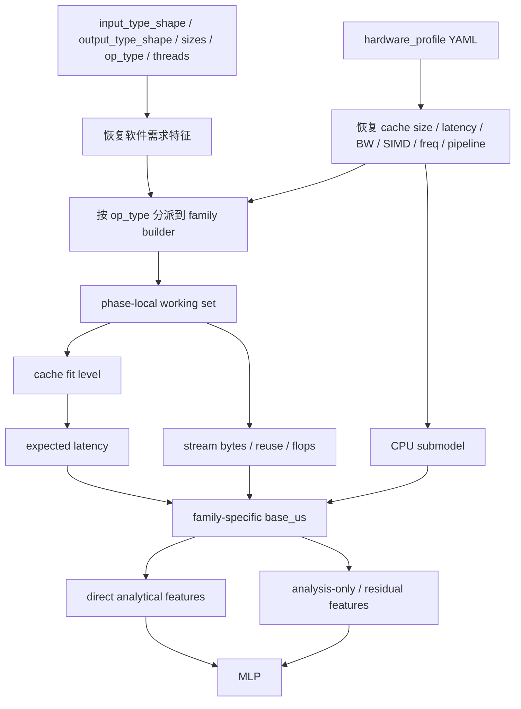
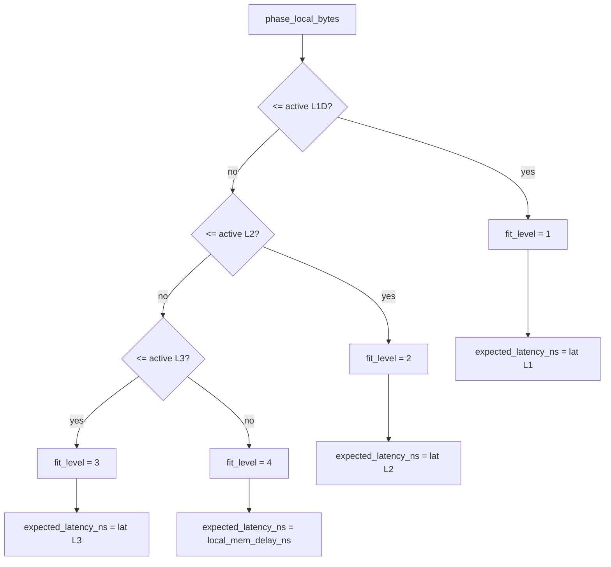
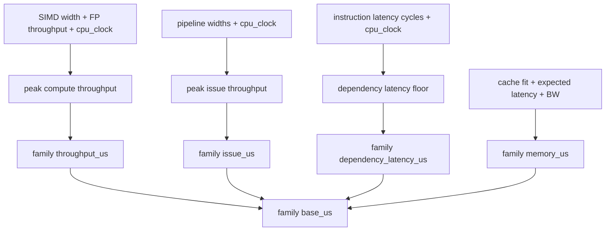
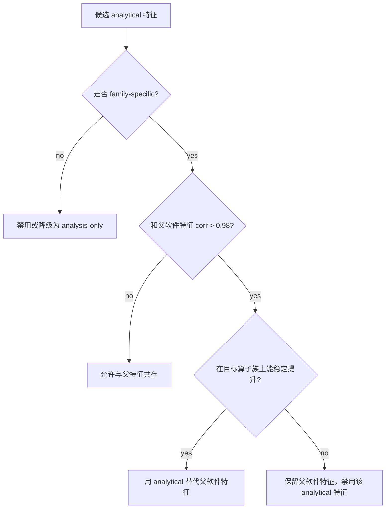
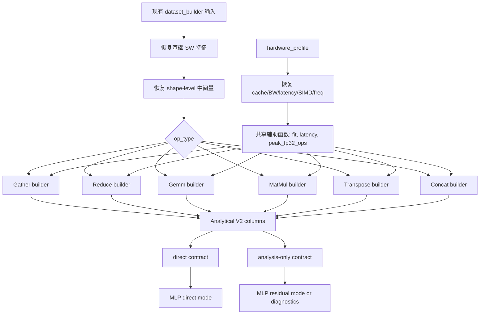

# Analytical Model V2 for `single_op_stage1_mlp`

这份文档给 `single_op_stage1_mlp` 里的 `Analytical Model V2` 做完整设计说明。目标不是直接把一个更复杂的解析模型硬塞进 MLP，而是把 ORT CPU kernel 的真实执行语义拆出来，重构一批更有物理含义、也更有泛化语义的软硬件结合特征。

这份文档回答 6 个问题：

1. 为什么 V1 的全局 `ana_*` 不够好
2. ORT CPU 里 `Gather`、`ReduceSum`、`Gemm`、`MatMul`、`Transpose`、`Concat` 具体是怎么做的
3. 为什么这些 kernel 应该用不同的 analytical model
4. 每个新特征表达什么含义
5. 每个新特征依赖哪些参数，这些参数现在是否已经在数据集中
6. 整体实现和验证流程应该怎么组织

## 1. 设计目标

### 1.1 我们要解决什么问题

当前 `single_op_stage1_mlp` 已经有一批有效的软硬件交互特征，例如：

- `hw_ratio_working_set_to_l1d_active_bytes`
- `hw_ratio_working_set_to_l2_active_bytes`
- `hw_ratio_working_set_to_l3_active_bytes`
- `comp_feat_pressure_ws_to_l2_ratio`
- `comp_feat_pressure_ws_to_l3_ratio`
- `ana_cache_fit_level`
- `ana_expected_latency_ns`

这些特征能抓住一阶的 cache capacity / latency 影响，但它们仍然有两个明显限制：

- 它们更接近“全局尺寸代理”，而不是“按算子访存机制拆开的局部工作集模型”
- 当前一批 analysis-only 的 `ana_*` 里，很多列在单硬件训练下容易退化成“软件特征换了个单位”

最典型的例子是：

- `ana_mem_bw_time_us = feat_io_bytes_sum / (bandwidth_gb_s_total * 1e3)`

在当前单 NUMA Kunpeng920 profile 下，`bandwidth_gb_s_total` 是常数 `100 GB/s`，所以：

```text
ana_mem_bw_time_us = feat_io_bytes_sum * 1e-5
```

这意味着它和 `feat_io_bytes_sum` 在当前硬件上是严格线性等价的。这样的 analytical 特征如果继续和纯软件特征一起喂给 MLP，通常只会增加冗余，而不是提供新信息。

### 1.2 V2 的核心原则

V2 固定采用下面三条原则：

- `Analytical ⊂ HWxSW`
- 所有 analytical 特征都必须基于“软件需求 + 硬件供给 + kernel 执行机制”的组合，而不是简单乘除
- analytical model 只建模对延迟最关键的一阶机制，剩余误差交给 MLP 学习

这里最重要的一句话是：

> V2 建模的对象不是“整算子总共有多少字节”，而是“这个算子的哪个执行阶段，在多大的局部工作集下，以什么样的访问模式，落在哪一级 cache / memory tier 上执行”。

## 2. V1 为什么不够

当前全局 analytical 列如下：

- `ana_cache_fit_level`
- `ana_expected_latency_ns`
- `ana_compute_ops`
- `ana_roofline_base_us`
- `ana_base_us`
- `ana_mem_bw_time_us`
- `ana_latency_proxy_us`
- `ana_ridge_gap`

这些列里，真正比较稳的是：

- `ana_cache_fit_level`
- `ana_expected_latency_ns`

原因很直接：它们至少把“工作集是否落进 L1/L2/L3”以及“超出后要付哪一级 latency”表达出来了。

而另外几列之所以还没进入主合同，不是因为 analytical 的方向错了，而是因为“建模粒度还不够细”：

- `ana_compute_ops` 是全局统一公式，没有区分 `Gather`、`Transpose` 这种 copy-dominated kernel 和 `Gemm` 这种 compute-dominated kernel
- `ana_roofline_base_us` 假定同一套 roofline 语义适用于所有算子族，这对 `Concat`、`Transpose`、`Gather` 并不成立
- `ana_latency_proxy_us` 把所有访存都近似成 `bytes / cacheline * expected_latency`，没有区分“流式 copy”和“随机 gather miss”
- `ana_ridge_gap` 对 `Gemm/MatMul` 有意义，对 `Concat/Transpose` 基本没有意义

所以 V2 的核心改动不是“再加更多全局 `ana_*`”，而是：

- 把 analytical feature family 改成 `family-specific`
- 把每个算子拆成若干执行阶段
- 把阶段工作集和 cache tier 绑定起来

## 3. ORT CPU kernel 分析结论

本节使用 ORT 官方 CPU kernel 源码作为第一手依据。这里不把源码逐行搬进来，而是提炼出建模真正需要的 kernel 语义。

源码入口：

- [`onnxruntime/core/providers/cpu/tensor/gather.cc`](https://github.com/microsoft/onnxruntime/blob/main/onnxruntime/core/providers/cpu/tensor/gather.cc)
- [`onnxruntime/core/providers/cpu/reduction/reduction_ops.cc`](https://github.com/microsoft/onnxruntime/blob/main/onnxruntime/core/providers/cpu/reduction/reduction_ops.cc)
- [`onnxruntime/core/providers/cpu/math/gemm.cc`](https://github.com/microsoft/onnxruntime/blob/main/onnxruntime/core/providers/cpu/math/gemm.cc)
- [`onnxruntime/core/providers/cpu/math/matmul.cc`](https://github.com/microsoft/onnxruntime/blob/main/onnxruntime/core/providers/cpu/math/matmul.cc)
- [`onnxruntime/core/providers/cpu/tensor/transpose.cc`](https://github.com/microsoft/onnxruntime/blob/main/onnxruntime/core/providers/cpu/tensor/transpose.cc)
- [`onnxruntime/core/providers/cpu/tensor/concat.cc`](https://github.com/microsoft/onnxruntime/blob/main/onnxruntime/core/providers/cpu/tensor/concat.cc)

### 3.1 总结表

| 算子 | ORT CPU 内核语义 | 对 cache 最敏感的对象 | 为什么不能和其他算子共用一套 analytical 公式 |
| --- | --- | --- | --- |
| `Gather` | index 驱动的 block copy，源地址不规则，目标写入连续 | source row reuse、L3/DRAM latency | 它不是“全张量顺序读”，而是“按索引离散取块” |
| `ReduceSum` | 先做 shape collapse，再按 `KR/RK/KRK/RKR/...` 走不同 fast path | accumulator 驻留、被累加输入是否连续 | 连续归约更像 streaming，非连续归约更像 stride-heavy 跳读，cache line 利用率和 miss 行为差异很大 |
| `Gemm` | bias broadcast + MLAS Gemm + activation，可 `PackB` | weight reuse、tile 驻留、SIMD 吞吐 | 核心是 blocked compute，不是简单 bytes 模型 |
| `MatMul` | `MatMulComputeHelper` + batched MLAS Gemm，可 `PackB` | batch reuse、rhs broadcast、weight 驻留 | 与 `Gemm` 相近，但 batch 结构不同 |
| `Transpose` | 先判定 reshape-like / single-axis / generic，再走 block-copy 或 eltwise-strided | suffix block size、stride locality | 不同 regime 的 cache 行为差别极大 |
| `Concat` | 对每个输入做 `DispatchStridedCopy`，沿 concat axis 推进输出偏移 | copy chunk size、streaming bandwidth | 更接近分块 copy，不是随机访存 |

### 3.2 为什么“先读权重和 bias，再读输入”不能做通用前提

这个说法不适合作为 analytical model 的通用规则。

对 `Gemm/MatMul`：

- ORT CPU float 路径最终落到 MLAS
- `B` 可能被预打包
- 实际访存次序由 MLAS 的 blocking、packing、线程分块和预取决定

也就是说：

- `bias` 常常只是一个很小的广播阶段
- `B` 是否能被 cache / packed buffer 重用，比“是不是先读”更重要
- 真正该建模的是“哪些 operand 在哪个 tile 窗口内复用”

因此，V2 不会把“读取顺序”当作主建模对象，而是建模：

- phase-local working set
- operand reuse
- cache fit level
- latency-sensitive 还是 bandwidth-sensitive

## 4. V2 的共享建模框架

### 4.1 统一符号

| 符号 | 含义 | 当前是否已在 `dataset_full.csv` |
| --- | --- | --- |
| `T` | `active_cores = min(num_threads, hw_core_total_cores)` | `num_threads` 已有；`hw_core_total_cores` 来自 hardware profile |
| `L1/L2/L3` | 活跃 cache 容量 | 由 profile 已有字段可重建 |
| `lat(L1/L2/L3/MEM)` | `response_latency_cycles / cpu_clock` 或 `local_mem_delay_ns` | profile 已有 |
| `BW` | `hw_memory_bandwidth_gb_s_total * 1e3` bytes/us | profile 已有 |
| `cacheline_bytes` | `hw_cache_cacheline_bytes` | profile 已有，可重建 |
| `W_simd` | `hw_instruction_simd_width_bits` | profile 已有，可重建 |
| `f_cpu` | `hw_core_cpu_clock` | profile 已有，可重建 |
| `L_fma / L_add` | `hw_instruction_fp_latency_cycles.vector_sp_fma / vector_sp_add` | profile 已有，可重建 |
| `Th_fma / Th_add` | `hw_instruction_fp_throughput_per_cycle.vector_sp_fma / vector_sp_add` | profile 已有，可重建 |
| `W_pipe` | `min(fetch, decode, rename, dispatch, issue, commit)` | profile 已有，可重建 |
| `peak_fp32_ops_per_us` | SIMD + FMA + freq + active cores 推导出的峰值计算吞吐 | profile 已有，可重建 |
| `fit(bytes)` | bytes 落入 L1/L2/L3/MEM 的 tier 编码 | 当前可重建，未统一封装为函数列 |

### 4.1.1 共享公式解释

本节里的符号会反复出现在后面的算子族公式里，先统一解释一次。

| 公式 | 解释 |
| --- | --- |
| `T = min(num_threads, hw_core_total_cores)` | 表示这次算子执行时理论上真正能参与工作的 core 数。之所以取 `min`，是因为线程数不可能让活跃 core 数超过机器总 core 数；如果线程数比物理 core 多，额外线程更多只是排队或上下文切换。 |
| `lat(level) = response_latency_cycles / cpu_clock` | cache latency 在 profile 里通常以 cycles 给出，但建模时需要时间单位，所以要除以 `cpu_clock` 把 cycles 转成 `ns`。如果 tier 已经落到主存，则直接使用 `local_mem_delay_ns`。 |
| `BW = hw_memory_bandwidth_gb_s_total * 1e3` | 把 `GB/s` 转成 `bytes/us`。因为 `1 GB/s = 10^9 bytes/s = 10^3 bytes/us`，所以乘 `1e3` 后就能直接拿来做 `bytes / BW = us`。 |
| `cacheline_bytes = hw_cache_cacheline_bytes` | 表示硬件 cache line 的固定粒度。它不会直接决定 kernel 的逻辑 block size，但会影响“多少流量大致对应多少次 load/store/cacheline access”的粗略 issue 近似，因此会在 `issue_us` 的公式里出现。 |
| `W_simd = hw_instruction_simd_width_bits` | `simd_width_bits` 决定一条向量指令一次能并行处理多少个元素。例如 `128-bit` SIMD 对 `fp32` 来说一次最多覆盖 `128 / 32 = 4` 个元素。这个量不直接作为 direct feature 暴露，而是先进入峰值吞吐公式。 |
| `f_cpu = hw_core_cpu_clock` | `cpu_clock` 既负责把 cycles 转成时间，也负责把“每 cycle 吞吐”放大成“每 us 吞吐”。换句话说，频率同时影响 latency 换算和 throughput ceiling。 |
| `L_fma / L_add = fp_latency_cycles.vector_sp_fma / vector_sp_add` | 浮点指令 latency 决定依赖链最短要花多少 cycles。即使带宽和 issue 都够，如果一条链必须等上一条 FMA 或 ADD 的结果，这部分 latency 仍然会形成时延下界。 |
| `Th_fma / Th_add = fp_throughput_per_cycle.vector_sp_fma / vector_sp_add` | 浮点吞吐决定每个 cycle 最多能退休多少条对应类型的向量指令。它与 `W_simd` 和 `f_cpu` 一起决定计算吞吐 ceiling。 |
| `W_pipe = min(fetch, decode, rename, dispatch, issue, commit)` | pipeline 中最窄的一段决定单位时间最多能推进多少条指令，因此用 `min(...)` 收束成一个共享的 `effective pipeline width`。 |
| `peak_fp32_ops_per_us = fp_throughput_per_cycle.vector_sp_fma * (simd_width_bits / 32) * 2 * cpu_clock_ghz * 1e3 * T` | 这是 float32 FMA 路径的峰值算力上界。`simd_width_bits / 32` 表示一条向量指令能同时处理多少个 `fp32` 元素；FMA 一次相当于 `mul + add` 两个浮点操作，所以乘 `2`；再乘频率和活跃 core 数，把“每 cycle 的向量吞吐”换成“每微秒的总吞吐”。 |
| `fit(bytes)` | `fit` 不是机器学习里的 fit，而是“这个局部工作集能装进哪一级 cache”。可以写成分段函数：`bytes <= active_L1D -> 1`，否则若 `<= active_L2 -> 2`，否则若 `<= active_L3 -> 3`，否则 `-> 4`。它的作用是把连续的工作集大小映射到离散的 cache tier，再用于选 latency。 |
| `max(x, 1)` 或 `max(x, epsilon)` | 文中很多公式都带这个保护项，它只是数值安全垫，用来避免除零、空 shape 或极端边界值导致公式失效。它不改变主导趋势，只是让 builder 在极端样本上仍然稳定。 |

### 4.2 共享流程



### 4.2.1 cache-tier 决策流程



### 4.2.2 CPU submodel

这一步的目标不是把 `cpu_clock`、`simd_width_bits`、`pipeline width` 原样塞进 MLP，而是先把它们收束成共享的 CPU 子模型。这个子模型只做三件事：

- 给出计算吞吐上界 `throughput ceiling`
- 给出发射/退休吞吐上界 `issue ceiling`
- 给出依赖链最短时延下界 `dependency latency floor`

固定公式如下：

| 中间变量 | 计算式 | 作用 |
| --- | --- | --- |
| `ana_cpu_effective_pipeline_width` | `min(fetch_width, decode_width, rename_width, dispatch_width, issue_width, commit_width)` | 收束出 pipeline 的最窄段，决定最大发电/退休宽度 |
| `ana_cpu_peak_issue_slots_per_us` | `ana_cpu_effective_pipeline_width * f_cpu * 1e3 * T` | 把每 cycle 的 issue 宽度换成每微秒的总指令槽位数 |
| `ana_cpu_peak_vec_fma_ops_per_us` | `Th_fma * (W_simd / 32) * 2 * f_cpu * 1e3 * T` | `fp32 FMA` 路径的向量计算吞吐上界 |
| `ana_cpu_peak_vec_add_ops_per_us` | `Th_add * (W_simd / 32) * f_cpu * 1e3 * T` | `fp32 ADD` 路径的向量加法吞吐上界 |
| `ana_cpu_fp_fma_latency_us` | `L_fma / (f_cpu * 1e3)` | 向量 FMA 依赖链的最短时延下界 |
| `ana_cpu_fp_add_latency_us` | `L_add / (f_cpu * 1e3)` | 向量 ADD 依赖链的最短时延下界 |

这些公式的解释如下：

| 公式 | 解释 |
| --- | --- |
| `ana_cpu_effective_pipeline_width = min(...)` | pipeline 真正能跑多宽，不由单个阶段决定，而由最窄的一段决定。因此直接取 `fetch/decode/rename/dispatch/issue/commit` 的最小值，把多段宽度收束成一个共享上界。 |
| `ana_cpu_peak_issue_slots_per_us = width * f_cpu * 1e3 * T` | `width` 是每 cycle 最多能推进多少条指令，乘频率后得到每秒/每微秒的指令槽位，再乘活跃 core 数得到整个执行域的 issue 上界。 |
| `ana_cpu_peak_vec_fma_ops_per_us = Th_fma * (W_simd / 32) * 2 * f_cpu * 1e3 * T` | `Th_fma` 给出每 cycle 可发多少条向量 FMA；`W_simd / 32` 表示每条向量 FMA 覆盖多少个 `fp32`；乘 `2` 是因为 FMA 对应 `mul + add` 两个浮点操作；最后乘频率和活跃 core 数转成全局时间吞吐。 |
| `ana_cpu_peak_vec_add_ops_per_us = Th_add * (W_simd / 32) * f_cpu * 1e3 * T` | 和 FMA 类似，但这里只有 add，不再乘 `2`。它更适合 `ReduceSum` 这种加法主导算子。 |
| `ana_cpu_fp_fma_latency_us = L_fma / (f_cpu * 1e3)` | `L_fma` 是 FMA 的 latency cycles，除以频率后得到时间单位，表示一条严格依赖上一条结果的 FMA 链最少要花多久。 |
| `ana_cpu_fp_add_latency_us = L_add / (f_cpu * 1e3)` | 与 FMA 相同，但用于向量加法依赖链。 |



在后面的 family builder 中，`throughput_us`、`issue_us`、`dependency_latency_us` 都视为中间变量，不建议直接进入主合同；真正进入主合同的是它们被吸收后的 `base_us`、`effective throughput` 和一个关键 bottleneck/regime 特征。

### 4.3 参数可用性状态说明

本文件里每个参数都按下面三种状态标注：

- `已有`：当前 `dataset_full.csv` 已经导出
- `可重建`：现在的数据集里没有独立列，但可由现有 `input_type_shape`、`output_type_shape`、size 列和 hardware profile 算出来
- `需新增`：当前既没导出，也不能稳定从现有列直接恢复

### 4.3.1 CPU 参数来源表

下面这些 CPU 量都已经存在于 [kunpeng920_single_numa.yaml](/data/qc/dlrm/ORT/single_op_stage1_mlp/hardware_profile/kunpeng920_single_numa.yaml) 中，只是当前没有作为 `dataset_full.csv` 的独立列导出。

| 参数 | YAML 来源 | 当前状态 | 用途 |
| --- | --- | --- | --- |
| `hw_core_cpu_clock` | `core.cpu_clock` | `已有于 profile，可重建为 analytical 中间变量；当前未作为 dataset_full.csv 独立列导出` | cycles 与时间换算；吞吐 ceiling |
| `hw_instruction_simd_width_bits` | `instruction.simd_width_bits` | `已有于 profile，可重建为 analytical 中间变量；当前未作为 dataset_full.csv 独立列导出` | 向量宽度；每条指令并行元素数 |
| `hw_instruction_fp_latency_cycles_vector_sp_fma` | `instruction.fp_latency_cycles.vector_sp_fma` | `已有于 profile，可重建为 analytical 中间变量；当前未作为 dataset_full.csv 独立列导出` | FMA 依赖链下界 |
| `hw_instruction_fp_latency_cycles_vector_sp_add` | `instruction.fp_latency_cycles.vector_sp_add` | `已有于 profile，可重建为 analytical 中间变量；当前未作为 dataset_full.csv 独立列导出` | ADD 依赖链下界 |
| `hw_instruction_fp_throughput_per_cycle_vector_sp_fma` | `instruction.fp_throughput_per_cycle.vector_sp_fma` | `已有于 profile，可重建为 analytical 中间变量；当前未作为 dataset_full.csv 独立列导出` | FMA 吞吐上界 |
| `hw_instruction_fp_throughput_per_cycle_vector_sp_add` | `instruction.fp_throughput_per_cycle.vector_sp_add` | `已有于 profile，可重建为 analytical 中间变量；当前未作为 dataset_full.csv 独立列导出` | ADD 吞吐上界 |
| `hw_pipeline_fetch_width` | `pipeline.fetch_width` | `已有于 profile，可重建为 analytical 中间变量；当前未作为 dataset_full.csv 独立列导出` | pipeline 上界组成部分 |
| `hw_pipeline_decode_width` | `pipeline.decode_width` | `已有于 profile，可重建为 analytical 中间变量；当前未作为 dataset_full.csv 独立列导出` | pipeline 上界组成部分 |
| `hw_pipeline_rename_width` | `pipeline.rename_width` | `已有于 profile，可重建为 analytical 中间变量；当前未作为 dataset_full.csv 独立列导出` | pipeline 上界组成部分 |
| `hw_pipeline_dispatch_width` | `pipeline.dispatch_width` | `已有于 profile，可重建为 analytical 中间变量；当前未作为 dataset_full.csv 独立列导出` | pipeline 上界组成部分 |
| `hw_pipeline_issue_width` | `pipeline.issue_width` | `已有于 profile，可重建为 analytical 中间变量；当前未作为 dataset_full.csv 独立列导出` | pipeline 上界组成部分 |
| `hw_pipeline_commit_width` | `pipeline.commit_width` | `已有于 profile，可重建为 analytical 中间变量；当前未作为 dataset_full.csv 独立列导出` | pipeline 上界组成部分 |

### 4.4 特征收束原则

V2 不会把所有 analytical 中间量都送进主合同。每个算子族最终只收束到少量主特征，其余量只作为构造这些主特征的中间变量。

统一规则如下：

- 每个算子族最多保留 `2~3` 个主 Analytical 特征进入 direct contract
- 其余 `row_bytes`、`unique_rows_est`、`stream_bytes`、`effective_weight_bytes`、`dispatch_penalty_us` 这类量只作为 builder 内部中间变量或 analysis-only 列
- 主特征优先选“直接对应性能”的量：
  - `base_us`：解析一阶时延
  - `throughput`：由 `bytes/base_us` 或 `flops/base_us` 得到的有效吞吐
  - `bottleneck/regime`：决定性能模式的一个关键离散或比率特征

建议的主合同收束如下：

| 算子族 | 主特征 1 | 主特征 2 | 主特征 3 |
| --- | --- | --- | --- |
| `Gather` | `ana_gather_base_us = max(memory_or_cache_us, copy_issue_us)` | `ana_gather_effective_bw_bytes_per_us = ana_gather_stream_bytes / ana_gather_base_us` | `ana_gather_src_fit_level` 或 `ana_gather_src_expected_latency_ns` |
| `ReduceSum` | `ana_reduce_base_us = max(memory_us, issue_us, dependency_latency_us, throughput_us)` | `ana_reduce_effective_bw_bytes_per_us = ana_reduce_stream_bytes / ana_reduce_base_us` | `ana_reduce_strided_flag` |
| `Gemm` | `ana_gemm_base_us = max(memory_us, throughput_us, issue_us, dependency_latency_us)` | `ana_gemm_effective_flops_per_us = ana_gemm_flops / ana_gemm_base_us` | `ana_gemm_compute_share = max(throughput_us, issue_us, dependency_latency_us) / ana_gemm_base_us` |
| `MatMul` | `ana_matmul_base_us = max(memory_us, throughput_us, issue_us, dependency_latency_us)` | `ana_matmul_effective_flops_per_us = ana_matmul_flops / ana_matmul_base_us` | `ana_matmul_rhs_broadcast_flag` |
| `Transpose` | `ana_transpose_base_us = max(memory_us, copy_issue_us)` | `ana_transpose_effective_bw_bytes_per_us = (2 * output_size) / ana_transpose_base_us` | `ana_transpose_regime_id` |
| `Concat` | `ana_concat_base_us = max(memory_us, copy_issue_us + dispatch_penalty_us)` | `ana_concat_effective_bw_bytes_per_us = ana_concat_stream_bytes / ana_concat_base_us` | `ana_concat_dispatch_share = ana_concat_dispatch_penalty_us / ana_concat_base_us` |

换句话说，`base_us` 和 `throughput` 是主线，regime/bottleneck 只保留一个最关键的。`throughput_us`、`issue_us`、`dependency_latency_us` 都只作为中间变量存在，不建议直接进主合同。

## 5. 按算子族的 Analytical V2

## 5.1 Gather

### 5.1.1 ORT kernel 语义

根据 `gather.cc`：

- 先算 `block_size = element_bytes * SizeFromDimension(axis + 1)`
- 然后对每个 `(batch, index)` 组合，用 index 定位源地址
- 再执行 `memcpy(dst + dst_offset, src + src_offset, block_size)`
- 最后按 `M * N` 做并行分发

可用下面伪代码概括：

```python
block_size = element_bytes * suffix_product_after_axis
for batch in range(M):
    for i in range(num_indices):
        idx = indices[i]
        src_offset = batch * data_batch_bytes + idx * block_size
        dst_offset = batch * gathered_batch_bytes + i * block_size
        memcpy(dst + dst_offset, src + src_offset, block_size)
```

其中 `block_size = element_bytes * suffix_product_after_axis` 的含义是：在 `Gather` 的目标轴上取到一个 `idx` 时，真正要搬运的不是单个标量，而是该 `idx` 后面整段连续后缀子张量。`suffix_product_after_axis` 给出这个后缀子张量有多少个元素，再乘 `element_bytes` 就得到一次逻辑 copy 的 payload 大小。

### 5.1.2 为什么这样建模

`Gather` 的核心不是“总共搬了多少字节”，而是：

- 每次 copy 的 block 有多大
- 被索引命中的 source rows 有多少 unique rows
- 这些 unique rows 是否能留在 L3
- source 侧是随机/半随机 miss，destination 侧通常是连续写

所以 `Gather` 不能再用全局 `ana_mem_bw_time_us` 或 `ana_latency_proxy_us` 近似。

### 5.1.3 CPU 融合方式

`Gather` 不是浮点依赖链主导的算子，因此这里不强调 `fp_latency`。CPU 侧只通过两条路径进入：

- `cpu_clock`：一方面把 cache/memory latency 从 cycles 转成时间，另一方面缩放 copy-loop 的 issue ceiling
- `issue ceiling`：估计大量小块 `memcpy` / copy-loop 在前端、dispatch、issue 上会不会先成为瓶颈

因此，`Gather` 的 CPU 融合逻辑固定为：

- 强主导：`cache/memory latency`
- 次主导：`copy issue ceiling`
- 弱影响：`SIMD width` 只作为 copy-loop 每条指令的 payload 近似，不作为浮点吞吐来解释

### 5.1.4 新特征

| 新特征 | 含义 | 计算式 | 依赖参数与状态 |
| --- | --- | --- | --- |
| `ana_gather_row_bytes` | 单次 lookup 命中的一行 embedding/block 大小 | `feat_output_elements_per_lookup * 4` | `feat_output_elements_per_lookup` `已有` |
| `ana_gather_request_rows` | 本次总共发起多少次 row 请求 | `feat_lookup_count` | `已有` |
| `ana_gather_table_rows` | 参数表一共有多少行 | `parameter_size / max(row_bytes, 1)` | `parameter_size` `已有` |
| `ana_gather_unique_rows_est` | 本次大概会触碰多少 unique rows | `table_rows * (1 - exp(-request_rows / max(table_rows, 1)))` | `可重建` |
| `ana_gather_src_unique_bytes_est` | source 侧的局部唯一工作集大小 | `unique_rows_est * row_bytes` | `可重建` |
| `ana_gather_stream_bytes` | streaming copy 的总搬运量 | `2 * output_size + 8 * feat_lookup_count` | `output_size` `已有` |
| `ana_gather_src_fit_level` | source unique rows 落在哪级 cache | `fit(src_unique_bytes_est)` | `可重建` |
| `ana_gather_src_expected_latency_ns` | source miss 对应的预期 tier latency | `lat(fit(...))` | `可重建` |
| `ana_gather_memory_or_cache_us` | source miss + copy 流量的 memory/cache 主导项 | `max(stream_bytes / BW, request_rows * latency / T)` | `可重建` |
| `ana_gather_copy_issue_us` | copy-loop 的 issue ceiling 项 | `(stream_bytes / max(W_simd / 8, 1)) / ana_cpu_peak_issue_slots_per_us` | `可重建` |
| `ana_gather_base_us` | Gather 的解析一阶基线 | `max(memory_or_cache_us, copy_issue_us)` | `可重建` |

最终建议进入主合同的 `Gather` 主特征只有 3 个：

- `ana_gather_base_us`
- `ana_gather_effective_bw_bytes_per_us`
- `ana_gather_src_fit_level` 或 `ana_gather_src_expected_latency_ns`

其余量，例如 `row_bytes`、`table_rows`、`unique_rows_est`、`stream_bytes`，都只作为构造中间变量。

### 5.1.5 公式解释

| 公式 | 解释 |
| --- | --- |
| `feat_output_elements_per_lookup * 4` | `feat_output_elements_per_lookup` 表示一次 lookup 平均会产出多少个元素；当前文档默认按 `float32` 估算，所以每个元素按 `4 bytes` 计，乘起来就是“一次 lookup 实际要搬多大一行”。 |
| `parameter_size / max(row_bytes, 1)` | 用参数总字节数除以单行字节数，近似估计 embedding table 有多少行。分母加 `max(..., 1)` 只是避免异常样本里 `row_bytes = 0` 时除零。 |
| `table_rows * (1 - exp(-request_rows / max(table_rows, 1)))` | 这是一个 occupancy 近似，用来估计本次请求真正触碰了多少个 unique rows。可以把它想成“往 `table_rows` 个桶里随机扔 `request_rows` 个球，最后有多少个桶至少被扔中过一次”。对任意一行来说，一次请求没命中它的概率约是 `1 - 1/table_rows`，连续 `request_rows` 次都没命中的概率近似为 `(1 - 1/table_rows) ^ request_rows`，当 `table_rows` 较大时再近似成 `exp(-request_rows / table_rows)`，于是“一行至少命中一次”的概率约等于 `1 - exp(-request_rows / table_rows)`，最后乘总行数就得到 unique rows 估计。 |
| `unique_rows_est * row_bytes` | 把“预计碰到多少不同 row”转换成“这些不同 row 一共占多少字节”，从而得到 source 侧真正影响 cache 的局部唯一工作集。 |
| `2 * output_size + 8 * feat_lookup_count` | `2 * output_size` 表示 source 侧读出结果和 destination 侧写入结果各算一份；`8 * feat_lookup_count` 表示每次 lookup 还要读取一个 `int64` index。它不是一次性搬运量，而是 Gather 这一阶段总的 streaming/copy 流量 proxy。 |
| `fit(src_unique_bytes_est)` | 判断 source unique working set 更像落在 `L1/L2/L3/MEM` 哪一层。它的目的不是精确模拟 cache，而是把“工作集大小”转成“最接近哪一级 latency”。 |
| `lat(fit(...))` | 先用 `fit` 选 tier，再取对应的 tier latency。如果 working set 只 fit 到 `L3`，就使用 `L3` latency；如果连 `L3` 都放不下，就退到主存 latency。 |
| `max(stream_bytes / BW, request_rows * latency / T)` | 这是 `memory_or_cache_us`。如果 block 比较大，Gather 更接近带宽受限 copy；如果 block 很小但 miss 很散，则更接近“每次 request 都要付一次 cache/memory latency”的模式。两者取 `max`，表达谁是真正的一阶主导。 |
| `(stream_bytes / max(W_simd / 8, 1)) / ana_cpu_peak_issue_slots_per_us` | 把 copy 流量粗略折算成“需要多少条向量/标量 copy 指令”，再除以 issue ceiling，得到前端/dispatch/issue 角度的时间下界。这里没有把 `Gather` 当作浮点 kernel，只是用 `SIMD width` 近似每条 copy 指令的 payload。 |
| `max(memory_or_cache_us, copy_issue_us)` | 这就是新版 `ana_gather_base_us`。它表示 `Gather` 的真实一阶瓶颈要么来自 source miss + copy 流量，要么来自大量小块 copy 把 issue 槽位先打满。 |
| `ana_gather_stream_bytes / ana_gather_base_us` | 这是 Gather 的有效带宽。不是硬件峰值带宽，而是“按当前 cache miss、copy 粒度和并发条件折算后，模型认为 Gather 实际跑出来的吞吐”。 |
## 5.2 ReduceSum

### 5.2.1 ORT kernel 语义

根据 `reduction_ops.cc`：

- 先把 `input_shape + reduce_axes` 送进 `OptimizeShapeForFastReduce`
- 根据 collapsed shape 和 reduce/keep 片段结构，分类成 `KR/RK/KRK/RKR/R/K/None`
- 对部分 regime 使用 fast path，否则退回 `NoTransposeReduce1Loop`

可用下面伪代码概括：

```python
fast_kind = optimize_shape_for_fast_reduce(input_shape, reduce_axes)
if fast_kind in {KR, RK, KRK, RKR} and shape_is_large_enough:
    run_fast_reduce(fast_kind)
else:
    run_generic_reduce_loop()
```

### 5.2.2 为什么这样建模

`ReduceSum` 的关键不只是“reduce 了多少元素”，而是：

- 被累加的输入数据在内存里是否连续
- partial sum 是不是能留在 L1/L2

所以 V2 里的 `ReduceSum` 需要一个 regime 特征，而不是只有全局 `feat_reduction_work_items`。

### 5.2.3 CPU 融合方式

`ReduceSum` 是 CPU submodel 使用较重的算子族之一，但它使用的是 `vector add` 路径，而不是 `FMA` 路径。这里固定引入三条 CPU 约束：

- `throughput ceiling`：连续归约时，更可能接近向量化加法吞吐
- `issue ceiling`：非连续归约或小 shape 时，load/store 与加法指令混合后可能被 issue 宽度限制
- `dependency latency floor`：对同一 partial sum 的连续累加天然带有依赖链，最短时延受 `ADD latency` 限制

这里的主导关系固定解释为：

- 连续归约：更接近 `throughput_us` 或 `memory_us`
- 非连续归约：更容易被 `issue_us` 和 `memory_us` 主导
- 极短向量链：`dependency_latency_us` 也可能成为下界

### 5.2.4 新特征

| 新特征 | 含义 | 计算式 | 依赖参数与状态 |
| --- | --- | --- | --- |
| `ana_reduce_fast_kind_id` | ORT fast-reduce regime 编码 | 按 `reduce/keep` 片段模式重建 | `input_type_shape/output_type_shape` `已有`, 但 `需新增` 独立导出 |
| `ana_reduce_reduce_extent` | 被归约部分的大小 | `feat_reduction_axes_product` | `已有` |
| `ana_reduce_keep_extent` | 输出保留部分的元素规模 | `max(output_size / 4, 1)` | `已有` |
| `ana_reduce_acc_bytes_per_thread` | 每线程 partial accumulator 大小 | `output_size / T` | `可重建` |
| `ana_reduce_acc_fit_level` | accumulator 驻留 tier | `fit(acc_bytes_per_thread)` | `可重建` |
| `ana_reduce_strided_flag` | 是否属于 stride 敏感 regime | `fast_kind in {RK, RKR, None}` | `需新增` |
| `ana_reduce_stream_bytes` | 输入和输出的 streaming 量 | `activation_size + output_size` | `已有` |
| `ana_reduce_add_ops` | Reduce 的加法工作量近似 | `reduce_extent * keep_extent` | `可重建` |
| `ana_reduce_memory_us` | memory/cache 主导项 | `stream_bytes / BW + strided_penalty_us` | `可重建` |
| `ana_reduce_throughput_us` | 向量加法吞吐上界对应的时间 | `add_ops / ana_cpu_peak_vec_add_ops_per_us` | `可重建` |
| `ana_reduce_issue_us` | issue ceiling 项 | `((add_ops / max(W_simd / 32, 1)) + (stream_bytes / cacheline_bytes)) / ana_cpu_peak_issue_slots_per_us` | `可重建` |
| `ana_reduce_dependency_latency_us` | partial sum 依赖链下界 | `reduce_extent * ana_cpu_fp_add_latency_us / max(W_simd / 32, 1)` 或 `reduce_extent * ana_cpu_fp_add_latency_us` | `可重建` |
| `ana_reduce_base_us` | Reduce 的解析一阶基线 | `max(memory_us, issue_us, dependency_latency_us, throughput_us)` | `可重建` |

最终建议进入主合同的 `ReduceSum` 主特征只有 3 个：

- `ana_reduce_base_us`
- `ana_reduce_effective_bw_bytes_per_us`
- `ana_reduce_strided_flag`

其余量，例如 `reduce_extent`、`keep_extent`、`acc_bytes_per_thread`、`throughput_us`、`issue_us`、`dependency_latency_us`，都只作为构造中间变量。

### 5.2.5 公式解释

| 公式 | 解释 |
| --- | --- |
| `feat_reduction_axes_product` | 表示所有被 reduce 掉的维度乘起来后的总规模，也就是一条输出值平均需要累加多少个输入元素。它是 ReduceSum 的“工作量”摘要，但还没告诉我们这些元素在内存里是否连续。 |
| `max(output_size / 4, 1)` | 当前默认把输出按 `float32` 近似，所以 `output_size / 4` 表示输出里大约有多少个元素，也就是 keep 部分的元素规模。加 `max(..., 1)` 是为了防止极端空输出。 |
| `output_size / T` | 把总输出字节数均摊到活跃线程，得到“每个线程大约要维护多少 partial sum”。如果这个值很小，partial accumulator 更可能一直驻留在寄存器或 L1/L2。 |
| `fit(acc_bytes_per_thread)` | 判断每线程 accumulator 更可能留在 L1/L2/L3 还是已经大到需要频繁溢出。这里真正关心的是 partial sum 的驻留，而不是输入张量总大小。 |
| `fast_kind in {RK, RKR, None}` | 这是一条 regime 判别规则。`RK`、`RKR` 和 generic `None` 通常意味着被累加输入不再是尾部连续块，访问更像 stride-heavy 跳读，所以把它们标成 `strided_flag = 1`；`KR`、`KRK`、`R` 之类更接近连续归约。 |
| `activation_size + output_size` | 把输入读流量和输出写流量相加，得到 ReduceSum 的基础 streaming 量。这里没有把 partial sum 额外单独展开成独立大项，是因为它主要通过 `acc_bytes_per_thread` 和 `acc_fit_level` 去控制 latency/驻留效应。 |
| `reduce_extent * keep_extent` | 把“每个输出值要加多少个输入元素”和“总共有多少个输出值”相乘，近似总加法工作量。这个量不追求精确到最后一次加法是否省掉，而是作为 CPU throughput 与 dependency latency 的统一需求摘要。 |
| `stream_bytes / BW + strided_penalty_us` | 这是 `memory_us`。连续归约时，主体更像流式带宽受限；一旦进入 stride-heavy regime，就要额外加上 `strided_penalty_us`，把 cache line 利用率差、prefetch 失效和 miss 增加的代价补回来。 |
| `add_ops / ana_cpu_peak_vec_add_ops_per_us` | 这是 `throughput_us`。它回答的是：如果 ReduceSum 的加法主体能够很好向量化，那么纯加法吞吐 ceiling 会要求至少花多久。 |
| `((add_ops / max(W_simd / 32, 1)) + (stream_bytes / cacheline_bytes)) / ana_cpu_peak_issue_slots_per_us` | 这是 `issue_us`。前一项把加法工作量折算成大致的向量/标量 add 指令数，后一项把 load/store 流量粗略折算成内存相关指令压力，然后一起除以 issue ceiling，近似前端和执行管线的发射上界。 |
| `reduce_extent * ana_cpu_fp_add_latency_us / max(W_simd / 32, 1)` 或 `reduce_extent * ana_cpu_fp_add_latency_us` | 这是 `dependency_latency_us`。连续归约时可以按向量宽度摊薄链深；非连续或低向量化归约时则要用更保守的链深估计。它表达的是“partial sum 这一条加法链最短也要等多久”。 |
| `max(memory_us, issue_us, dependency_latency_us, throughput_us)` | 新版 `ana_reduce_base_us` 显式把 memory、issue、依赖链和向量吞吐四种上界统一起来。这样 CPU 的 `SIMD width / latency / frequency / pipeline width` 就通过中间变量被吸收到最终主特征里。 |
| `ana_reduce_stream_bytes / ana_reduce_base_us` | 这是 ReduceSum 的有效带宽。它能直接反映“同样的输入输出字节量，在连续归约和 stride-heavy 归约下最终跑出来的吞吐差了多少”。 |

## 5.3 Gemm

### 5.3.1 ORT kernel 语义

根据 `gemm.cc`：

- 先做 bias broadcast
- 主体进入 `math::Gemm` / `MlasGemm`
- float path 支持 `PackB`
- 最后可能再做 activation

伪代码如下：

```python
broadcast_bias_if_needed(C, Y)
if K == 0:
    handle_empty_case()
else:
    if B_is_prepacked:
        MlasGemm(A, packed_B, Y)
    else:
        math.Gemm(A, B, Y)
apply_activation_if_needed(Y)
```

### 5.3.2 为什么这样建模

`Gemm` 的关键不在“总共读了多少字节”，而在：

- `2MNK` 的计算量
- `A/B/C` 三个 operand 的复用
- `B` 是否可以被缓存/预打包后重复使用
- 算子更接近 compute-bound 还是 memory-bound

因此，V2 对 `Gemm` 采用“算力 + 权重复用 + cache 驻留”的三件套，而不是全局 copy 模型。

### 5.3.3 CPU 融合方式

`Gemm` 是六个算子族里最完整使用 CPU submodel 的一个。这里 CPU 侧三条约束都会显式生效：

- `vector FMA throughput`：决定理想向量计算吞吐上界
- `FMA latency`：决定沿 `K` 维依赖链的最短时延下界
- `issue ceiling`：决定指令发射/退休上界，特别是在小 shape 或低复用场景下

因此，`Gemm` 的主导关系固定表达为：

- 大 shape、高 `ai`：更可能被 `throughput_us` 或 `dependency_latency_us` 主导
- 权重复用差、带宽紧：更可能被 `memory_us` 主导
- 小 shape 或前端压力高：`issue_us` 会更明显

### 5.3.4 新特征

| 新特征 | 含义 | 计算式 | 依赖参数与状态 |
| --- | --- | --- | --- |
| `ana_gemm_flops` | GEMM 理论浮点运算量 | `2 * M * N * K` | `M/N/K` 当前 `可重建`，需从 shape 单独导出 |
| `ana_gemm_ai` | arithmetic intensity | `flops / max(activation_size + parameter_size + output_size, 1)` | `activation_size/parameter_size/output_size` `已有` |
| `ana_gemm_weight_fit_level` | 权重矩阵是否能被 cache 重用 | `fit(parameter_size)` | `可重建` |
| `ana_gemm_output_fit_level` | 输出 tile/accumulator 的驻留层级 | `fit(output_size / T)` | `可重建` |
| `ana_gemm_effective_weight_bytes` | 经过 reuse 摘要后的权重有效搬运量 | `parameter_size` 或 `parameter_size / min(max(M,1), T)` | `可重建` |
| `ana_gemm_memory_us` | memory/cache 主导项 | `(activation_size + effective_weight_bytes + output_size) / BW` | `可重建` |
| `ana_gemm_throughput_us` | FMA 吞吐 ceiling 项 | `flops / ana_cpu_peak_vec_fma_ops_per_us` | `可重建` |
| `ana_gemm_issue_us` | issue ceiling 项 | `((flops / (2 * max(W_simd / 32, 1))) + ((activation_size + effective_weight_bytes + output_size) / cacheline_bytes)) / ana_cpu_peak_issue_slots_per_us` | `可重建` |
| `ana_gemm_dependency_latency_us` | FMA 依赖链下界 | `(K / max(W_simd / 32, 1)) * ana_cpu_fp_fma_latency_us` | `可重建` |
| `ana_gemm_base_us` | GEMM 一阶基线 | `max(memory_us, throughput_us, issue_us, dependency_latency_us)` | `可重建` |
| `ana_gemm_compute_share` | 计算侧主导程度 | `max(throughput_us, issue_us, dependency_latency_us) / base_us` | `可重建` |

最终建议进入主合同的 `Gemm` 主特征只有 3 个：

- `ana_gemm_base_us`
- `ana_gemm_effective_flops_per_us`
- `ana_gemm_compute_share`

其余量，例如 `flops`、`ai`、`effective_weight_bytes`、`throughput_us`、`issue_us`、`dependency_latency_us`，都只作为构造中间变量。

### 5.3.5 公式解释

| 公式 | 解释 |
| --- | --- |
| `2 * M * N * K` | 这是标准 GEMM 的理论浮点操作数。对 `C = A x B`，每个输出元素需要 `K` 次乘法和 `K-1` 次加法，建模里通常近似成 `K` 次 FMA，所以记成 `2MNK` 个浮点操作。 |
| `flops / max(activation_size + parameter_size + output_size, 1)` | 这是 arithmetic intensity，表示“每搬 1 byte 数据，平均能做多少浮点操作”。它越高，越可能是 compute-bound；越低，越可能是 memory-bound。 |
| `fit(parameter_size)` | 用权重总大小近似判断 `B` 矩阵是否有机会长期留在较高层 cache。对 GEMM 来说，权重是否能被反复复用，比“权重是不是先读”更重要。 |
| `fit(output_size / T)` | 把输出/accumulator 大小均摊到线程，估计每线程输出 tile 或 partial sum 更可能驻留在哪一级 cache。这个量决定了输出回写前能否在小缓存里多做一些累加。 |
| `parameter_size` 或 `parameter_size / min(max(M, 1), T)` | 这是对权重复用的摘要。如果 `B` 不能很好复用，就把整块权重都算成有效搬运量；如果 `B` 能在 `M` 行或多个线程间被重用，就按复用程度把有效搬运量折减。`min(max(M, 1), T)` 表示复用上限不会超过输出行数，也不会超过并行线程数。 |
| `(activation_size + effective_weight_bytes + output_size) / BW` | 这是 `memory_us`。它把输入激活、有效权重流量和输出写回流量加总后除以内存带宽 proxy，得到纯流量视角下至少需要的时间。 |
| `flops / ana_cpu_peak_vec_fma_ops_per_us` | 这是 `throughput_us`。它用 CPU submodel 给出的向量 FMA 吞吐 ceiling 计算理想算力下界，因此显式吸收了 `SIMD width + FMA throughput + frequency + active cores`。 |
| `((flops / (2 * max(W_simd / 32, 1))) + ((activation_size + effective_weight_bytes + output_size) / cacheline_bytes)) / ana_cpu_peak_issue_slots_per_us` | 这是 `issue_us`。前一项把 FLOPs 粗略折算成 FMA 指令数量，后一项把流量折算成近似的 load/store 指令压力，然后一起除以 issue ceiling，得到前端/发射角度的时间下界。 |
| `(K / max(W_simd / 32, 1)) * ana_cpu_fp_fma_latency_us` | 这是 `dependency_latency_us`。它刻画的是同一输出通道沿 `K` 维做乘加时，依赖链最短也要等待多久。向量越宽，单条链深越容易被摊薄；FMA latency 越高，链下界越明显。 |
| `max(memory_us, throughput_us, issue_us, dependency_latency_us)` | 新版 `ana_gemm_base_us` 把 memory、算力吞吐、issue 上界和依赖链下界统一到一个 `max` 框架里，明确表达“谁最紧，谁就是一阶主导”。 |
| `ana_gemm_flops / ana_gemm_base_us` | 这是 GEMM 的有效计算吞吐，表示在当前 cache 复用和并发条件下，解析模型认为 GEMM 实际能跑到多少 `FLOPs/us`。 |
| `max(throughput_us, issue_us, dependency_latency_us) / base_us` | 这是 `compute_share`。它不是只看纯算力吞吐，而是把所有 CPU 侧计算约束合并后，再看它们在总时延里占多少比例。比例越高，说明 GEMM 越偏 CPU 计算主导。 |

## 5.4 MatMul

### 5.4.1 ORT kernel 语义

根据 `matmul.cc`：

- 用 `MatMulComputeHelper` 把输入 shape 归一化
- 按 batch offset 组织 `MlasGemmBatch/MlasSBGemmBatch`
- 同样支持 `PackB`

伪代码如下：

```python
helper = MatMulComputeHelper(a_shape, b_shape)
for i in range(num_batches):
    A_i = A[left_offset[i]]
    B_i = packed_B or B[right_offset[i]]
    Y_i = Y[out_offset[i]]
    MlasGemmBatch(A_i, B_i, Y_i)
```

### 5.4.2 为什么和 Gemm 分开

`MatMul` 和 `Gemm` 的主体很像，但多了 batch 结构、broadcast 和 batch offset 处理，所以需要额外区分：

- 右操作数是不是 batch-broadcast
- `B` 能否在 batch 间复用
- batch count 有多大

### 5.4.3 CPU 融合方式

`MatMul` 的 CPU 融合方式和 `Gemm` 相同：仍然由 `vector FMA throughput`、`FMA latency`、`issue ceiling` 三条路径进入。与 `Gemm` 不同的地方不在 CPU submodel 本身，而在 batch/broadcast 结构会改变 `effective_weight_bytes` 和 reuse 语义。

因此这里要强调：

- CPU submodel 不变
- batch count 和 `rhs_broadcast_flag` 会改变 memory/reuse 项
- 最终 `base_us` 仍然由 `memory_us / throughput_us / issue_us / dependency_latency_us` 四者竞争决定

### 5.4.4 新特征

| 新特征 | 含义 | 计算式 | 依赖参数与状态 |
| --- | --- | --- | --- |
| `ana_matmul_batch_count` | batch 循环次数 | 由 leading dims 乘积重建 | `input/output shape` `已有`, 但 `需新增` 独立导出 |
| `ana_matmul_rhs_broadcast_flag` | 右操作数是否被 batch 复用 | 根据 rank 和 leading dims 判断 | `需新增` |
| `ana_matmul_flops` | MatMul 理论运算量 | `2 * M * N * K * batch_count` | `可重建` |
| `ana_matmul_memory_us` | memory/cache 主导项 | `memory_us_gemm_like * batch_correction` | `可重建` |
| `ana_matmul_throughput_us` | FMA 吞吐 ceiling 项 | `flops / ana_cpu_peak_vec_fma_ops_per_us` | `可重建` |
| `ana_matmul_issue_us` | issue ceiling 项 | `issue_us_gemm_like * batch_correction` | `可重建` |
| `ana_matmul_dependency_latency_us` | FMA 依赖链下界 | `dependency_us_gemm_like * batch_correction` | `可重建` |
| `ana_matmul_base_us` | MatMul 一阶基线 | `max(memory_us, throughput_us, issue_us, dependency_latency_us)` | `可重建` |

最终建议进入主合同的 `MatMul` 主特征只有 3 个：

- `ana_matmul_base_us`
- `ana_matmul_effective_flops_per_us`
- `ana_matmul_rhs_broadcast_flag`

### 5.4.5 公式解释

| 公式 | 解释 |
| --- | --- |
| `leading dims product` | 把 `M/K/N` 之前的 leading dimensions 相乘，得到 batched MatMul 的 batch 次数。它表示同一个 kernel 语义要重复执行多少个独立的 GEMM-like 子问题。 |
| `rhs_broadcast_flag` | 判断右操作数 `B` 是否在 batch 维上被广播复用。如果为真，说明多个 batch slice 可以重复消费同一份 `B`，这样 `B` 的有效搬运量会下降，cache 重用会变好。 |
| `2 * M * N * K * batch_count` | 这是把单个 GEMM 的理论 FLOPs 扩展到 batched MatMul。单 batch 是 `2MNK`，再乘 batch 数就得到总计算量。 |
| `memory_us_gemm_like * batch_correction` / `issue_us_gemm_like * batch_correction` / `dependency_us_gemm_like * batch_correction` | 这些写法强调：MatMul 的 CPU submodel 沿用 GEMM 的同一套公式，但要再乘 batch 结构修正。这个修正不是盲目线性放大，而是会被 `rhs_broadcast_flag` 和 batch reuse 抵消一部分。 |
| `max(memory_us, throughput_us, issue_us, dependency_latency_us)` | MatMul 的 `base_us` 与 Gemm 保持同样的 max 框架，只是各项中间变量已经被 batch/reuse 结构修正过。 |
| `ana_matmul_flops / ana_matmul_base_us` | 这是 MatMul 的有效计算吞吐。若 `rhs_broadcast_flag = 1`，同样的 FLOPs 可能在更低的有效权重流量下完成，所以这个吞吐通常会更高。 |

## 5.5 Transpose

### 5.5.1 ORT kernel 语义

根据 `transpose.cc`：

- 若只是“非 1 维顺序不变”，则走 reshape-like copy
- 若只移动单个轴，则走 `SingleAxisTranspose`
- 否则进入 generic transpose
- generic transpose 继续按 `prefix_blocksize/suffix_blocksize` 选择 block-copy 或 eltwise-strided

伪代码如下：

```python
if is_transpose_reshape(perm, input_dims):
    copy_tensor()
elif is_moving_single_axis(perm):
    single_axis_transpose()
else:
    suffix_block = largest_identity_suffix(perm)
    if prefix_blocksize == 1:
        memcpy_whole_block()
    elif suffix_blocksize == 1:
        elementwise_strided_transpose()
    else:
        blockwise_transpose()
```

### 5.5.2 为什么这样建模

`Transpose` 最重要的不是总字节数，而是：

- 当前属于哪种 regime
- contiguous suffix block 有多大
- source 访问是 block-copy 还是 elementwise stride

这决定了它更像 `memcpy`，还是更像“高 miss 的 strided load/store”。

### 5.5.3 CPU 融合方式

`Transpose` 的 CPU 融合方式和 `Gather` 类似，属于 copy-dominated 路径：

- 强主导：`memory/cache` 行为
- 次主导：`copy-loop issue ceiling`
- 弱影响：`SIMD width` 和 `cpu_clock` 只通过 copy 指令粒度与 issue ceiling 进入

这里不强调 `fp_latency`，因为 `Transpose` 不是浮点依赖链主导的计算型算子。

### 5.5.4 新特征

| 新特征 | 含义 | 计算式 | 依赖参数与状态 |
| --- | --- | --- | --- |
| `ana_transpose_regime_id` | reshape/single-axis/generic-block/generic-eltwise 编码 | 根据 perm 和 suffix block 规则判断 | `input/output shape` `已有`, 但 `需新增` |
| `ana_transpose_suffix_block_bytes` | contiguous suffix block 大小 | suffix dims product * dtype bytes | `可重建` |
| `ana_transpose_prefix_blocks` | 要遍历多少个 block | total elements / suffix block elements | `可重建` |
| `ana_transpose_src_fit_level` | suffix block 落在哪级 cache | `fit(suffix_block_bytes)` | `可重建` |
| `ana_transpose_stream_us` | streaming copy 主导项 | `2 * output_size / BW` | `可重建` |
| `ana_transpose_latency_us` | generic regime 的额外 latency 成本 | `prefix_blocks * latency` 或 `num_elements * latency / T` | `可重建` |
| `ana_transpose_memory_us` | memory/cache 主导项 | `stream_us + latency_us` | `可重建` |
| `ana_transpose_copy_issue_us` | copy-loop issue ceiling 项 | `((2 * output_size) / max(W_simd / 8, 1)) / ana_cpu_peak_issue_slots_per_us` | `可重建` |
| `ana_transpose_base_us` | Transpose 一阶基线 | `max(memory_us, copy_issue_us)` | `可重建` |

最终建议进入主合同的 `Transpose` 主特征只有 3 个：

- `ana_transpose_base_us`
- `ana_transpose_effective_bw_bytes_per_us`
- `ana_transpose_regime_id`

### 5.5.5 公式解释

| 公式 | 解释 |
| --- | --- |
| `suffix dims product * dtype bytes` | `suffix dims product` 表示从某个连续后缀开始，一次 block-copy 能覆盖多少个元素；再乘每元素字节数，就得到 contiguous suffix block 的字节大小。这个量决定了 Transpose 更像“大块 memcpy”还是“小粒度跳读跳写”。 |
| `total elements / suffix block elements` | 把总元素数除以单个 suffix block 的元素数，得到一共要处理多少个 block。block 越多、每个 block 越小，越容易进入高 dispatch/high miss 的 regime。 |
| `fit(suffix_block_bytes)` | 判断一个连续 suffix block 本身能否很好地留在 `L1/L2/L3`。它不是在看整个张量能否进 cache，而是在看“这个被反复拿来搬运的小块”是否 cache-friendly。 |
| `2 * output_size / BW` | Transpose 至少要把数据从源位置读一遍、再往目标位置写一遍，所以 streaming 量近似是 `2 * output_size`。除以带宽得到 block-copy 视角下的时间下界。 |
| `prefix_blocks * latency` 或 `num_elements * latency / T` | 如果是 generic-block regime，主要问题是每个 block 的定位和搬运都要付一次 latency，所以按 block 数乘 latency；如果是 generic-eltwise regime，每个元素都可能以 stride 方式访问，所以更像按元素数累计 latency，并由 `T` 个线程分摊。 |
| `stream_us + latency_us` | 这是 `memory_us`。和 GEMM 不同，Transpose 的 block-copy 与 stride penalty 往往不容易完全重叠，所以这里用“流量项 + 额外 latency 项”更符合 copy-like kernel 的语义。 |
| `((2 * output_size) / max(W_simd / 8, 1)) / ana_cpu_peak_issue_slots_per_us` | 这是 `copy_issue_us`。它把读写总字节数粗略折算成 copy 指令数量，再除以 issue ceiling，估计 front-end / dispatch / issue 是否先成为瓶颈。 |
| `max(memory_us, copy_issue_us)` | 新版 `ana_transpose_base_us` 表示：Transpose 的一阶瓶颈要么是 memory/cache 侧，要么是 copy-loop 自身把 issue 槽位先打满。 |
| `(2 * output_size) / ana_transpose_base_us` | 这是 Transpose 的有效带宽。它能直接反映当前 transpose regime 是否接近 memcpy 性能，还是已经被 stride-heavy 模式严重拖慢。 |

## 5.6 Concat

### 5.6.1 ORT kernel 语义

根据 `concat.cc`：

- 先准备输出张量和输出 stride
- 依次遍历每个输入
- 对每个输入调用 `DispatchStridedCopy`
- 然后沿 concat axis 推进输出偏移

伪代码如下：

```python
output_offset = 0
for tensor in inputs:
    if tensor.num_elements == 0:
        continue
    dispatch_strided_copy(dst=Y, dst_offset=output_offset, src=tensor)
    output_offset += concat_axis_extent(tensor)
```

### 5.6.2 为什么这样建模

`Concat` 更像“多个 chunk 的串行/并行 copy 组合”，其主要影响因素是：

- 输入张量个数
- 每个 chunk 的大小
- chunk 是不是足够大到能变成稳定的流式拷贝

### 5.6.3 CPU 融合方式

`Concat` 与 `Transpose` 类似，也属于 copy-dominated 算子族。CPU 侧只保留：

- `issue ceiling`：很多小 chunk 时，dispatch 与小 copy 循环会先消耗 issue 槽位
- `cpu_clock`：把 copy-loop 的 issue ceiling 和 latency 换算到时间域

这里同样不强调 `fp_latency`，因为 `Concat` 的主体不是浮点依赖链。

### 5.6.4 新特征

| 新特征 | 含义 | 计算式 | 依赖参数与状态 |
| --- | --- | --- | --- |
| `ana_concat_input_count` | 要拼接多少个输入 | 输入 tensor 数 | 当前 `需新增`，但可从 `input_type_shape` 重建 |
| `ana_concat_chunk_bytes_mean` | 平均每个 chunk 的 copy 大小 | `input_bytes_sum / input_count` | `input_bytes_sum` 当前 `需新增` |
| `ana_concat_chunk_fit_level` | 平均 chunk 落在哪级 cache | `fit(chunk_bytes_mean)` | `可重建` |
| `ana_concat_stream_bytes` | 总 streaming 量 | `input_bytes_sum + output_size` | `input_bytes_sum` `需新增` |
| `ana_concat_memory_us` | memory/cache 主导项 | `stream_bytes / BW` | `可重建` |
| `ana_concat_copy_issue_us` | copy-loop issue ceiling 项 | `(stream_bytes / max(W_simd / 8, 1)) / ana_cpu_peak_issue_slots_per_us` | `可重建` |
| `ana_concat_dispatch_penalty_us` | 每个 chunk 的 dispatch/latency 开销 | `input_count * latency / 1000` | `可重建` |
| `ana_concat_base_us` | Concat 一阶基线 | `max(memory_us, copy_issue_us + dispatch_penalty_us)` | `可重建` |

最终建议进入主合同的 `Concat` 主特征只有 3 个：

- `ana_concat_base_us`
- `ana_concat_effective_bw_bytes_per_us`
- `ana_concat_dispatch_share`

### 5.6.5 公式解释

| 公式 | 解释 |
| --- | --- |
| `input_bytes_sum / input_count` | 用总输入字节数除以输入 tensor 个数，得到平均每个 chunk 的 copy 大小。这个值决定 Concat 更像“少量大块流式 copy”，还是“很多个小块 copy”。 |
| `fit(chunk_bytes_mean)` | 判断平均 chunk 是否足够大到能稳定形成 cache-friendly / bandwidth-friendly 的 copy。如果 chunk 很小，即便总字节量不小，也可能因为 dispatch 开销和 cache line 利用率差而变慢。 |
| `input_bytes_sum + output_size` | Concat 至少要把所有输入读一遍，再把结果写到输出里，所以总 streaming 量近似为“所有输入字节 + 输出字节”。 |
| `stream_bytes / BW` | 这是 `memory_us`，回答的是“如果 Concat 完全是流式拷贝，总共需要多久”。 |
| `(stream_bytes / max(W_simd / 8, 1)) / ana_cpu_peak_issue_slots_per_us` | 这是 `copy_issue_us`。它把流量换成近似 copy 指令数，再用 issue ceiling 折算成时间，用来描述很多小 chunk 时的 front-end / issue 压力。 |
| `input_count * latency / 1000` | 每增加一个输入 chunk，就多一次 dispatch/offset 计算/小块 copy 的启动成本。`latency` 这里用 `ns` 表示，所以除以 `1000` 把它换成 `us`。 |
| `max(memory_us, copy_issue_us + dispatch_penalty_us)` | 新版 `ana_concat_base_us` 表示：Concat 的一阶瓶颈既可能是总流量，也可能是“小 chunk 太多”导致 copy-loop issue 压力和 dispatch 开销先打满。 |
| `ana_concat_stream_bytes / ana_concat_base_us` | 这是 Concat 的有效带宽。它比硬件峰值带宽更接近“当前 chunk 粒度下真实跑出来的 copy 吞吐”。 |
| `ana_concat_dispatch_penalty_us / ana_concat_base_us` | 这是 `dispatch_share`，用来衡量总时延里有多大比例是由“小 chunk 太多”带来的管理和启动开销决定的。比例越高，说明 Concat 越不适合只用总字节量来解释。 |

## 6. 为什么不把原始 CPU 常数直接喂给模型

当前任务要求 CPU 模型必须涵盖：

- 指令位宽和延时
- CPU 频率
- 流水线宽度

但这并不等于这些量必须作为原始 direct features 直接暴露给 MLP。原因有三点：

- 在当前单硬件数据下，`cpu_clock`、`simd_width_bits`、`pipeline_width` 几乎是常数，直接进 MLP 的新增信息很弱
- 这些常数真正有意义的地方，不是它们本身，而是它们如何改变 `throughput ceiling / issue ceiling / dependency latency floor`
- 把原始 CPU 常数直接喂进去，很容易让模型学到“当前机器的常数偏置”，而不是“CPU 机制如何影响不同算子”

因此，V2 的固定策略是：

- 原始 CPU 量先进入共享 `CPU submodel`
- 共享 `CPU submodel` 生成 `throughput_us / issue_us / dependency_latency_us`
- 各算子族再把这些中间变量吸收到 `base_us`、`effective throughput`、`compute_share` 或 `dispatch_share` 之类的主特征里

对应关系可以压缩成下面这张表：

| 原始 CPU 量 | 进入哪个共享中间变量 | 最终影响哪个主特征 |
| --- | --- | --- |
| `cpu_clock` | `ana_cpu_peak_issue_slots_per_us`、`ana_cpu_peak_vec_fma_ops_per_us`、`ana_cpu_peak_vec_add_ops_per_us`、`ana_cpu_fp_fma_latency_us`、`ana_cpu_fp_add_latency_us` | 所有算子族的 `base_us`；`Gemm/MatMul` 的 `effective_flops_per_us`；`ReduceSum` 的 `effective_bw_bytes_per_us` |
| `simd_width_bits` | `ana_cpu_peak_vec_fma_ops_per_us`、`ana_cpu_peak_vec_add_ops_per_us`、copy-loop 的 `copy_issue_us` 近似 payload | `Gemm/MatMul` 的 `base_us` 与 `compute_share`；`ReduceSum` 的 `base_us`；`Gather/Transpose/Concat` 的 `copy_issue_us` |
| `fp_latency_cycles.vector_sp_fma` | `ana_cpu_fp_fma_latency_us` | `Gemm/MatMul` 的 `dependency_latency_us`，进而影响 `base_us` 与 `compute_share` |
| `fp_latency_cycles.vector_sp_add` | `ana_cpu_fp_add_latency_us` | `ReduceSum` 的 `dependency_latency_us`，进而影响 `base_us` |
| `fp_throughput_per_cycle.vector_sp_fma` | `ana_cpu_peak_vec_fma_ops_per_us` | `Gemm/MatMul` 的 `throughput_us`，进而影响 `base_us` 与 `effective_flops_per_us` |
| `fp_throughput_per_cycle.vector_sp_add` | `ana_cpu_peak_vec_add_ops_per_us` | `ReduceSum` 的 `throughput_us`，进而影响 `base_us` |
| `pipeline widths` | `ana_cpu_effective_pipeline_width`、`ana_cpu_peak_issue_slots_per_us` | 各算子族的 `issue_us` 或 `copy_issue_us`，最终影响 `base_us` |

这也解释了为什么当前 `dataset_full.csv` 里看不到这些 CPU 量的独立列，但文档仍然说“CPU 模型已经涵盖了它们”：

- 它们被吸收到共享 analytical 中间变量里
- 再被 family-specific 主特征吸收
- 最终模型看到的是“CPU 条件化后的性能量”，而不是一堆几乎不变的硬件常数

## 7. 新旧 analytical 特征映射

| 当前列 | V2 里的命运 | 原因 |
| --- | --- | --- |
| `ana_cache_fit_level` | 保留，但会被 family-specific `*_fit_level` 逐步替代 | 方向是对的，但现在太全局 |
| `ana_expected_latency_ns` | 保留，但会被 family-specific `*_expected_latency_ns` 逐步替代 | 方向是对的，但现在没区分 phase |
| `ana_compute_ops` | 退役为全局列 | 应拆成 `ana_gemm_flops`、`ana_matmul_flops`、`ana_reduce_*` |
| `ana_mem_bw_time_us` | 退役为 direct 特征 | 在单硬件下和 `feat_io_bytes_sum` 严格线性等价 |
| `ana_latency_proxy_us` | 退役 | 应由 `gather/reduce/transpose` 各自的 latency term 替代 |
| `ana_roofline_base_us` | 退役为全局列 | roofline 只适合 `Gemm/MatMul` 主体 |
| `ana_base_us` | 退役为全局列 | 应改成 family-specific `*_base_us` |
| `ana_ridge_gap` | 改成 `ana_gemm_ridge_gap` / `ana_matmul_ridge_gap` | 对 copy-like ops 没语义 |

## 8. 为什么不直接用 Analytical 特征替代纯软件特征

结论固定为：**不能全局替代，只能局部替代。**

原因有三点：

- 纯软件特征表达的是 workload demand，本身仍然是必要输入
- analytical 特征表达的是“被硬件条件化后的 demand”
- 在单硬件数据下，如果 analytical 特征只是纯软件特征乘了一个常数，它就不应该和父软件特征共存

正确做法是：

- 保留最小必要的软件需求特征
- 用 family-specific analytical 特征表达机制差异
- 若某 analytical 特征和父软件特征共线到 `corr > 0.98`，只能二选一



推荐保留的软件基础特征：

- `op_type`
- `batch_size`
- `num_indices_per_lookup`
- `num_threads`
- `output_size`
- `activation_size`
- `parameter_size`
- `feat_lookup_count`
- `feat_output_elements_per_lookup`
- `feat_reduction_axes_count`
- `feat_reduction_axes_product`
- 当前并发特征

## 9. 整体流程计划



### 9.1 建议实施顺序

1. 先补数据可用性缺口，只增加能够稳定从现有 shape 与 size 信息重建的列
2. 先实现 `Gather`、`ReduceSum`、`Transpose`、`Concat` 的 family builder
3. 再实现 `Gemm/MatMul` 的 family builder
4. 先不删除旧 `ana_*`，保留兼容导出
5. 做 family 级别 ablation，再决定哪些列进主合同

### 9.2 推荐验证顺序

1. `current baseline`
2. `baseline + Gather/Reduce/Transpose/Concat analytical`
3. `baseline + Gemm/MatMul analytical`
4. `baseline + all Analytical V2`
5. `reduced SW + Analytical V2`
6. `Analytical V2 residual`

## 10. 文档层面的落地结论

这份 V2 设计的关键结论可以压缩成三句话：

- 不同算子必须有不同的 analytical model，因为 ORT CPU kernel 的执行语义本来就不同
- analytical 特征不能继续是全局统一尺寸代理，必须变成 family-specific 的 phase-local 特征
- 在缺少多硬件训练数据时，最合理的做法不是删除软件特征，而是让 analytical 特征承担“硬件条件化解释”的职责，并通过共线性检查决定是否替代某些摘要型软件特征

如果后续实现按这份文档推进，那么 `single_op_stage1_mlp` 里的软硬件结合将不再停留在“工作集 / cache 大小”这一层，而会变成“kernel 机制 + cache tier + latency/bandwidth 主导关系”的组合建模。
