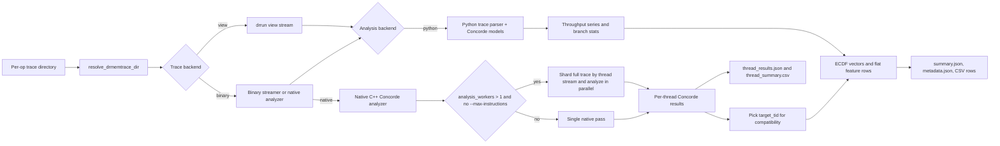

# ORT Concorde

`ORT/concorde` is an isolated, paper-aligned side pipeline for extracting Concorde-style
trace features and performance distributions from the existing ORT per-op offline traces.

It does not change the current `ORT/model` training flow. Instead, it produces standalone
artifacts that can later be merged into the operator dataset as extra `concorde_*` features.

## What it uses

- Existing ORT offline traces under `ORT/dynamorio_tracing/`
- The current hardware profile under `ORT/model/hardware_profiles/`
- The local Concorde analytical-model implementation under
  `ORT/concorde/src/`

## Data flow

1. Locate one per-op `drmemtrace.*.dir`
2. Read the existing offline trace with either:
   - `drrun -t drmemtrace -tool view` streaming, or
   - a direct binary reader that emits compact pseudo-view records
3. Run Concorde-style trace parsing and analytical models:
   - ROB throughput
   - Static bandwidth resources
   - Load/Load-Store pipe bounds
   - I-cache fills
   - Fetch buffer throughput
   - Branch predictor misprediction rates
4. Convert throughput series into performance distributions (ECDF quantile vectors)
5. Emit merge-friendly flat CSV rows keyed by `combo`, `op_idx`, and `op_name`

### End-to-end execution path

The coarse flow above maps to the current implementation like this:

- `run_concorde_sweep.py` discovers per-op trace directories and launches one analysis job per operator.
- `run_concorde_trace_analysis.py` resolves the concrete `drmemtrace.*.dir`, selects the trace backend, and writes the final per-op artifacts.
- The Python path parses the trace and runs the Concorde models in `ORT/concorde/src/`.
- The native path runs `native/concorde_native_analyzer.cpp`, then converts the native results back into the same JSON/CSV artifact family.
- In native threaded mode, the analyzer keeps a compatibility-friendly primary thread in `summary.json` and also writes all thread-level results to `thread_results.json` and `thread_summary.csv`.



## Important fidelity note

The analytical-model and feature-encoding logic now lives entirely in the local
`ORT/concorde/src/`, so this side pipeline is self-contained at runtime.

The default adapter still uses `drrun -t drmemtrace -tool view` as the bridge from ORT
offline trace directories into those analytical modules, but it parses the output as a
stream by default instead of first materializing a huge text file. That keeps this path
isolated and dramatically reduces disk pressure. If you need the raw text trace for
debugging, add `--materialize-view-log`.

There is now also an optional direct binary backend that reads the existing `drmemtrace.*.dir`
offline trace with DynamoRIO's analyzer API and emits a compact pseudo-view stream that is
compatible with the current Python Concorde parser. This avoids the expensive `-tool view`
text expansion step without requiring trace re-extraction.

There is also a native full-trace analysis backend that bypasses the Python hot path entirely,
computes the Concorde models inside C++, and can parallelize full-trace analysis across thread
streams when `--analysis-workers` is enabled.

## Timing evolution and optimization strategy

The same operator trace, `bs128_nip100/00000_Gather_emb_l0_Gather`, now has three useful
reference points in this repository:

| Stage | Artifact log | Backend path | Wall time |
| --- | --- | --- | ---: |
| Baseline Python path | `ORT/concorde/artifacts/bs128_nip100/00000_Gather_emb_l0_Gather/run.log` | binary trace stream + Python parsing/models | 11136.494 s |
| Native single-pass path | `ORT/concorde/artifacts_native/bs128_nip100/00000_Gather_emb_l0_Gather/run.log` | binary trace + native C++ analyzer | 1228.898 s |
| Native threaded path | `ORT/concorde/artifacts_native_threads/bs128_nip100/00000_Gather_emb_l0_Gather/run.log` | binary trace + native analyzer + thread-parallel full-trace analysis | 528.707 s |

This corresponds to roughly:

- `9.06x` speedup from the baseline Python path to the native single-pass path
- `2.32x` additional speedup from native single-pass to native threaded analysis
- `21.06x` end-to-end speedup from the baseline Python path to the native threaded path

For the baseline run, `trace_parse_total=8914.150s` and `analyze_trace_wrapper=2222.332s`, so
roughly `80%` of wall time was still spent getting the trace into Python-friendly form and the
remaining `20%` was spent in Python analytical models such as `rob_model` and
`branch_predictor_tage`.

The large reductions come from a few concrete changes:

1. Keep the pipeline on offline binary traces instead of expanding everything through
   `drrun -t drmemtrace -tool view`.
2. Move the Concorde analytical-model hot path out of Python and into the native analyzer so
   parse, bookkeeping, and model execution happen in one C++ pass.
3. Preserve all thread-level results in native mode and parallelize full-trace analysis across
   independent thread streams with `--analysis-workers`.
4. Continue using sweep-level parallelism with `--jobs` so multiple operators can run at once in
   addition to the per-operator thread parallelism.

A more detailed view of the three stages is:

### 1. Baseline: binary stream + Python analysis

- `run_concorde_trace_analysis.py` streams compact binary records and builds Python-side parsed
  instruction structures.
- `analyze_trace()` then runs ROB, static bandwidth, pipe, I-cache, fetch-buffer, and branch
  predictor models in Python.
- This is the path represented by `ORT/concorde/artifacts/.../run.log`.
- For the example operator, the main remaining hotspots are `trace_parse_total`, `rob_model`,
  and `branch_predictor_tage`.

### 2. Native: one full-trace native pass

- `run_concorde_trace_analysis.py --analysis-backend native` calls
  `run_native_concorde_analyzer.sh`.
- `native/concorde_native_analyzer.cpp` reads the binary trace directly, computes the Concorde
  models natively, and writes `native_analysis.json`.
- Python then only converts that native result into the standard artifact set.
- This is the path represented by `ORT/concorde/artifacts_native/.../run.log`.

### 3. Native threaded: full-trace analysis sharded by thread stream

- The native analyzer enables DynamoRIO analyzer worker threads when the run is a full trace.
- Each thread stream is analyzed independently, the results are collected into `thread_results`,
  and the most instruction-heavy thread is exposed as the compatibility `target_tid`.
- `run_concorde_trace_analysis.py` materializes both the primary per-op view and the full
  thread-level outputs:
  - `summary.json` keeps the compatibility view plus a compact thread summary
  - `thread_results.json` stores every thread's detailed Concorde outputs
  - `thread_summary.csv` stores one compact row per thread
- For `00000_Gather_emb_l0_Gather`, the final artifact reports `thread_count=4`.
- This is the path represented by `ORT/concorde/artifacts_native_threads/.../run.log`.

### Practical ways to keep trace time low

- Prefer `--trace-backend binary` over `view` for normal runs.
- Prefer `--analysis-backend native` for full-trace production analysis.
- Add `--analysis-workers N` for native full-trace runs when the trace contains multiple active
  threads.
- Keep `--jobs` at the sweep level so operator analyses overlap too.
- Use `--trace-cache-root` or `--compact-trace-cache` for repeated Python-side binary runs across
  multiple configs or bounded prefix experiments.
- Avoid `--materialize-view-log` unless you are debugging parsing, because it adds extra I/O.
- Do not expect native thread parallelism when `--max-instructions` is set; the native analyzer
  intentionally falls back to serial mode in that case so the global instruction cap stays exact.

## Config

`config/kunpeng920_gem5.yaml` is a Concorde-oriented architecture config derived from
`ORT/model/hardware_profiles/kunpeng920_gem5.yaml` plus a small set of Concorde-specific
defaults for parameters that are not directly exposed by the current gem5 profile
(for example `load_store_pipes` and `fetch_buffer.entries`).

You can regenerate that config with:

```bash
python ORT/concorde/sync_concorde_config.py
```

## Usage

Analyze one operator trace directory:

```bash
python ORT/concorde/run_concorde_trace_analysis.py \
  --trace-dir ORT/dynamorio_tracing/drrio_traces_sweep/bs128_nip100/00000_Gather_emb_l0_Gather \
  --config ORT/concorde/config/kunpeng920_gem5.yaml \
  --output-dir /tmp/ort_concorde_probe
```

Build the optional direct binary backend:

```bash
bash ORT/concorde/build_binary_trace_backend.sh
```

Then use it for one operator with the Python analysis path:

```bash
python ORT/concorde/run_concorde_trace_analysis.py \
  --trace-dir ORT/dynamorio_tracing/drrio_traces_sweep/bs128_nip100/00000_Gather_emb_l0_Gather \
  --config ORT/concorde/config/kunpeng920_gem5.yaml \
  --output-dir /tmp/ort_concorde_probe \
  --trace-backend binary \
  --binary-streamer ORT/concorde/run_binary_trace_backend.sh

# Reuse a compact binary cache across repeated config runs and optionally cap
# the processed prefix for a bounded fast-budget run.
python ORT/concorde/run_concorde_trace_analysis.py \
  --trace-dir ORT/dynamorio_tracing/drrio_traces_sweep/bs128_nip100/00000_Gather_emb_l0_Gather \
  --config ORT/concorde/config/kunpeng920_gem5.yaml \
  --output-dir /tmp/ort_concorde_probe_fast \
  --trace-backend binary \
  --binary-streamer ORT/concorde/run_binary_trace_backend.sh \
  --compact-trace-cache /tmp/ort_concorde_cache/bs128_nip100_00000.bin \
  --max-instructions 5000000
```

To reproduce the native single-pass path used by
`ORT/concorde/artifacts_native/bs128_nip100/00000_Gather_emb_l0_Gather`:

```bash
python ORT/concorde/run_concorde_trace_analysis.py \
  --trace-dir ORT/dynamorio_tracing/drrio_traces_sweep/bs128_nip100/00000_Gather_emb_l0_Gather \
  --config ORT/concorde/config/kunpeng920_gem5.yaml \
  --output-dir /tmp/ort_concorde_probe_native \
  --trace-backend binary \
  --analysis-backend native \
  --native-analyzer ORT/concorde/run_native_concorde_analyzer.sh
```

To reproduce the native threaded path used by
`ORT/concorde/artifacts_native_threads/bs128_nip100/00000_Gather_emb_l0_Gather`:

```bash
python ORT/concorde/run_concorde_trace_analysis.py \
  --trace-dir ORT/dynamorio_tracing/drrio_traces_sweep/bs128_nip100/00000_Gather_emb_l0_Gather \
  --config ORT/concorde/config/kunpeng920_gem5.yaml \
  --output-dir /tmp/ort_concorde_probe_native_threads \
  --trace-backend binary \
  --analysis-backend native \
  --native-analyzer ORT/concorde/run_native_concorde_analyzer.sh \
  --analysis-workers 4
```

This backend now emits one compact record per instruction instead of a multi-line
pseudo-view text trace, which removes most of the Python regex overhead from the bridge
layer. The CLI also prints stage progress and timing summaries to `stderr`, and the same
timings are saved in `summary.json` under `timings`.

The script will emit:

- `metadata.json`
- `throughput_series.json`
- `cdf_vectors.json`
- `branch_prediction.json`
- `performance_distribution_row.csv`
- `ml_input_row.csv`
- `summary.json`

Native threaded runs also emit:

- `thread_results.json`
- `thread_summary.csv`

`performance_distribution_row.csv` contains only Concorde performance-distribution features
(`z` in the paper), which is the most natural input for later fusion with the existing
operator dataset.

`summary.json` includes a timing breakdown such as:

- `trace_parse_total`
- `rob_model`
- `branch_predictor_tage`
- `analyze_trace_wrapper`
- `wall_total`

If a run is still slow after switching to the binary backend, these timings will usually
show that the bottleneck has moved from trace expansion/parsing into the Python analytical
models themselves, especially `rob_model` and branch prediction.

Generate Figure 1 style CDF plots from one analyzed operator:

```bash
python ORT/concorde/plot_concorde_cdfs.py \
  --artifact-dir ORT/concorde/test/ort_concorde_probe
```

Run Concorde analysis over an entire sweep directory:

```bash
python ORT/concorde/run_concorde_sweep.py \
  --trace-root ORT/dynamorio_tracing/drrio_traces_sweep \
  --config ORT/concorde/config/kunpeng920_gem5.yaml \
  --output-root ORT/concorde/artifacts \
  --jobs 4 \
  --resume
```

To use the direct binary backend for the whole sweep, add:

```bash
  --trace-backend binary \
  --binary-streamer ORT/concorde/run_binary_trace_backend.sh
```

To switch the whole sweep to the native analyzer, also add:

```bash
  --analysis-backend native \
  --native-analyzer ORT/concorde/run_native_concorde_analyzer.sh
```

To enable native thread-level parallel full-trace analysis for each operator, add:

```bash
  --analysis-workers 4
```

For multi-config sweeps, add a shared cache root so each per-op trace only needs
to be expanded into the compact cache once. If you need a bounded fast run, also
add `--max-instructions`:

```bash
  --trace-cache-root /tmp/ort_concorde_cache \
  --max-instructions 5000000
```

When combining sweep-level `--jobs` with per-op `--analysis-workers`, tune them together to fit
the machine. A good rule is to avoid oversubscribing cores: native threaded analysis speeds up
single operators, while `--jobs` increases operator-level concurrency.

You can collect those per-op rows into one merge-ready CSV with:

```bash
python ORT/concorde/collect_concorde_rows.py \
  --artifacts-root ORT/concorde/artifacts \
  --output-csv /tmp/concorde_performance_rows.csv
```

That merged CSV is keyed by `hardware_name`, `combo`, and `op_idx`, so it can later be
joined with the current `ORT/model` dataset without changing the existing training path.

Fuse Concorde CDF features into the current operator dataset:

```bash
python ORT/concorde/fuse_concorde_with_dataset.py \
  --dataset-csv ORT/model/artifacts/kunpeng920_gem5_label_real_dur_us/dataset.csv \
  --concorde-csv /tmp/concorde_performance_rows.csv \
  --output-csv /tmp/dataset_with_concorde.csv \
  --report-json /tmp/dataset_with_concorde_report.json
```

By default the fusion step drops `concorde_static_{fetch,decode,rename,commit}_width_*`
because those CDFs are degenerate copies of the existing `hw_core_*` width features.
